# Лабораторная работа №1: Logisim

## § Цели
- Научиться проектировать и выполнять отладку простых цифровых логических цепей в Logisim.
- Проектировать конечные автоматы (FSM) и реализовать их как цифровую логическую схему.
- Приобрести дополнительный опыт проектирования и отладки схем с комбинационной логикой и элементами памяти.

## § Подготовка

Вся работа в этой лабораторной будет выполнена при помощи **Logisim Evolution**.

Прочтите несколько следующих предупреждений, прежде чем начать:

- Logisim - это программа с графическим интерфейсом, поэтому она не может быть 
просто так запущена среде без графического интерфейса (WSL, SSH и т.д.). Мы рекомендуем запускать ее в **локальной среде** с поддержкой графического интерфейса, Java 9+, а также Python 3.6+. Если ваша локальная система - это macOS или Linux, то, скорее всего, от вас не требуется никаких действий. Однако, если вы используете Windows, используйте `Git Bash`, который запускается под Windows с поддержкой графического интерфейса.
- Пожалуйста, используйте ту версию Logisim, которую предоставляем именно мы, поскольку она отличается от других версий из интернета и гарантированно работает для предложенных заданий.
- Не перемещайте уже расставленные входные/выходные контакты; ваша цепь не сможет правильно протестироваться, если контакты были смещены. Если ваша цепь не проходит тесты, но вы считаете, что в ней всё корректно, то проверьте помещается ли ваша цепь в соответствующий жгут в `tests/ex#_test.circ`
- Logisim не сохраняет вашу работу автоматически. Поэтому, не забывайте сохранять ее регулярно вручную.

### § Возможные ошибки при подготовке
- "Доступ запрещён" (Permission Denied), если вы пытаетесь запустить Python из-под Windows 10.
    1. В поисковой строке Windows напишите "псевдонимы выполнения приложения" (в англ. версии Windows "app execution alias") и нажмите Enter.
    2. В открывшемся окне отключите магазинные версии Python как на изображении.
    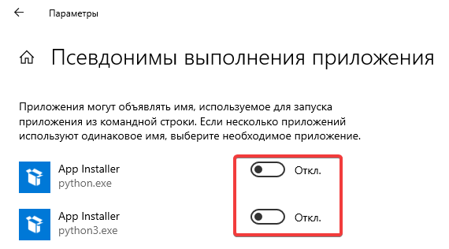
- `java.lang.UnsupportedClassVersionError`

```sh
Exception in thread "main" java.lang.UnsupportedClassVersionError: com/cburch/logisim/Main has been compiled by a more recent version of the Java Runtime (class file version 53.0), this version of the Java Runtime only recognizes class file versions up to 52.0
```

Вам необходимо обновить Java до версии 9+.

---

## § Задание 0. Введение
Прямо как с Venus, вы можете запустить Logisim из-под директории `lab01` при помощи команды:

```sh
$ java -jar logisim-evolution.jar # Если Logisim находится в другом месте, то замените путь на соответствующий.
```

После небольшой последовательности запуска должно появится окно с немного "древним" видом. Если же нет, то проверьте терминал на наличие ошибок во время запуска.

Мы начнём с создания очень простой цепи, чтобы понять каким образом в этой программе можно размещать логические вентили и провода. Перед тем, как начать, **возьмите себе на заметку полезную функцию масштабирования изображения!** В нижнем левом углу окна программы находится ползунок масштабирования. Не забудьте про него, и это облегчит вашу работу в программе.

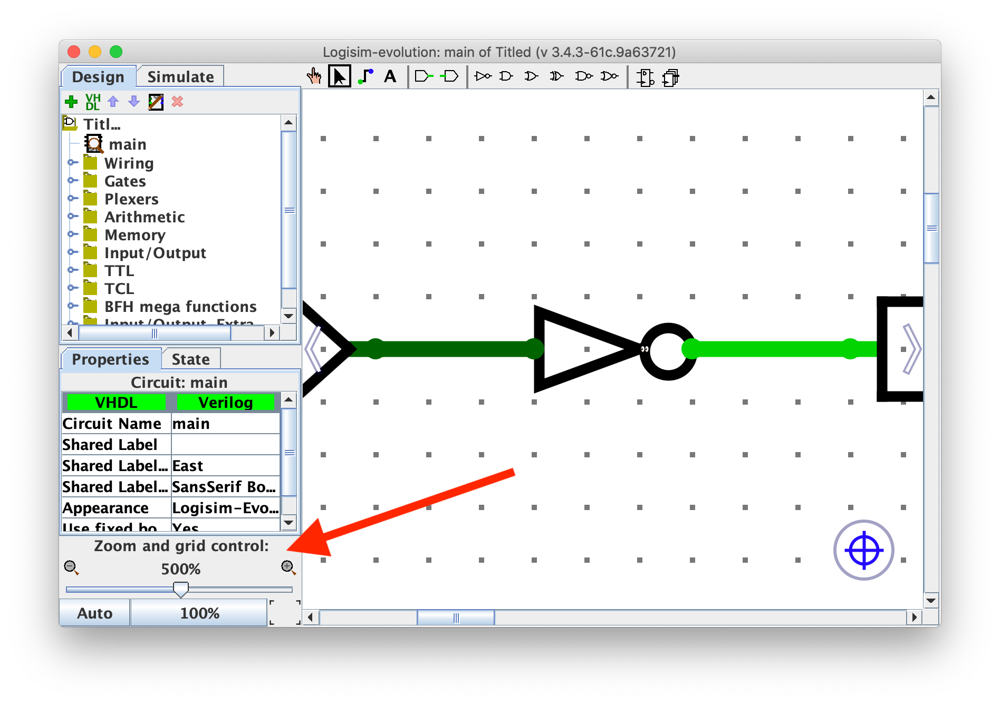

### § Строим нашу собственную цепь

1. ![Вентиль AND] Начните, нажав на кнопку логического вентиля `AND`. Это приведёт к тому, что тень вентиля `AND` будет следовать за вашим указателем. Единожды щёлкните внутри главного окна схемы, чтобы разместить вентиль `AND`.
2. ![Входной контакт] Нажмите на кнопку `Input Pin`. Теперь, разместите два входных контакта где-нибудь слева от вашего вентиля `AND`.
3. ![Выходной контакт] Нажмите на кнопку `Output Pin`, а затем разместите выходной контакт где-нибудь справа от вашего вентиля `AND`. На этом моменте ваша цепь должна выглядеть примерно так же, как на изображении:


4. ![Инструмент "Выбор"] Нажмите на кнопку `Select tool`. Зажмите кнопку мыши и перетащите курсор, чтобы подключить 2 входных контакта с 2-мя входами на левой стороне вентиля `AND`. Этот шаг займет несколько действий, поскольку вы можете рисовать только вертикальные и горизонтальные провода. Нарисуйте соединяющий провод горизонтально, отпустите кнопку мыши, а затем зажмите кнопку мыши и перетащите курсор, начиная с конца провода, чтобы продолжить его рисовать вертикально. Повторите ту же самую процедуру, чтобы соединить выход на правой стороне вентиля `AND` с выходным контактом. После выполнения всех действий ваша цепь должна выглядеть примерно так же, как на изображении:


5. ![Инструмент "Щуп"] Наконец, выберите инструмент `Poke` (щуп) и попробуйте понажимать на входные контакты в вашей цепи. Посмотрите, что произойдет. Соответствует ли выходной сигнал тому, что, по вашему мнению, должен делать вентиль `AND`? Теперь, попробуйте "пощупать" провод прямо. Должно появиться текущее значение соответствующего провода; это может быть очень полезно позже, когда вы будете строить более сложные цепи.

6. Теперь, удалим провода и попробуем соединить каждый входной контакт с *другим* контактом на вентиле `AND`, чтобы таким образом получилось, что провода скрещиваются. Крайний пример:
 


Если вы создаете провод и перетаскиваете его **через** другой провод без остановки, то провода не соединятся. Если вы создаете провод и отпускаете его поверх другого провода, создастся стык (большой круг), а провода соединятся. При разработке схем обязательно обращайте внимание на стыки!

### § Список цветов проводов и их значений
Пожалуйста, ознакомьтесь с этим списком. Это должно помочь вам воссоздать каждый цвет самостоятельно.


| Цвет                    | Значение                                                                                                                                                                                                                                                                                                    |
|-----------------------------|-------------------------------------------------------------------------------------------------------------------------------------------------------------------------------------------------------------------------------------------------------------------------------------------------------------|
| Темно-зеленый               | 1-битный провод имеет значение 0                                                                                                                                                                                                                                                                            |
| Светло-зеленый              | 1-битный провод имеет значение 1                                                                                                                                                                                                                                                                            |
| Черный                      | Многобитовый провод (многие компоненты имеют атрибутом битовую ширину, которая могдет быть настроена в меню атрибутов слева внизу)                                                                                                                                                                          |
| Красный (значение с EEEE) | Провод имеет несколько значений на нем (в данном случае 0 и 1 с двух входов), что соответствует короткому замыканию. Также помните, что на стыках проводов появляется большой круг.                                                                                                                         |
| Синий (значение с UUUU)   | Провод является плавающим (т.е. не имеет известного значения)                                                                                                                                                                                                                                               |
| Оранжевый                   | Провод подключается к компонентам, имеющим разную ширину бита. Простой пример - 1-битный входной контакт, соединенный с 2-битным выходным контактом. В показанном примере есть немного скрытый провод за MUX, соединяющий 2-битную нижнюю линию данных с 1-битной линией выбора. Будьте внимательны с этим! |

|**Примечание об удобстве использования:**|
|:---------------------------|
| Если вам трудно определять эти цвета, пожалуйста, не стесняйтесь использовать более удобный набор цветов. Для этого зайдите в `File -> Preferences -> Simulation Tab`. Пожалуйста, сообщите сотрудникам курса об этом изменении, когда будете демонстрировать свои схемы, так как мы часто используем цвета в качестве инструмента отладки.      |


---

## § Задание 1: Подсхемы
Как программы на языке С могут содержать вспомогательные функции, так и цепь может содержать вспомогательные подсхемы. В этой части лабораторной работы мы создадим несколько подсхем, чтобы продемонстрировать их использование.

Примечание: Logisim Evolution обычно не разрешает имена с пробелами или символами, имена, начинающиеся с цифр, или имена, конфликтующие с ключевыми словами (например, `NAND`).

### § Ход работы
Выполните следующие шаги. Не забывайте как можно чаще **сохранять свою работу**, **не перемещайте** и **не редактируйте предоставленные контакты входа/выхода**.

1. Откройте схему задания 1 (`File -> Open -> lab01/ex1.circ`)
2. Откройте образец подсхем `AND2`, дважды щелкнув `AND2` в селекторе схем слева.


Обратите внимание на `2` в конце; поскольку существует компонент под названием `AND`, и мы не можем назвать его `AND`. Мы создали демонстрационную схему для вашего ознакомления. Она имеет 2 1-битных входных контакта, `A` и `B`, и посылает результат `A & B` на выходной контакт `RESULT`. Она должна выглядеть очень похоже на схему, которую вы только что сделали.

3. Откройте подсхему `NAND2`. А теперь время сделать вашу собственную цепь! Заполните эту схему, **не** используя встроенный вентиль `NAND` из библиотеки вентилей слева (т.е. используйте только вентили `AND`, `OR` и `NOT`; они доступны в виде маленьких иконок на панели инструментов в верхней части окна или в библиотеке вентилей в селекторе схем). Когда вы закончили с этим шагом, аналогично заполните `NOR2`, `XOR2`, `MUX2` (2 к 1 MUX) и `MUX4` (4 к 1 MUX).
    - Пожалуйста, не изменяйте названия подсхем и не создавайте новые, иначе ваша цепь может работать неправильно.
    - Не используйте никаких других встроенных вентилей, кроме `AND`, `OR` или `NOT`. Однако, как только вы создадите подсхему, вы можете (и это приветствуется) использовать её для создания других подсхем. Вы можете сделать это, единожды щелкнув по подсхеме в селекторе схем, а затем разместить ее так же, как вы это делали с вентилями `AND`/`NOT`/`OR`.
    - Это поможет составить таблицу истинности для каждой схемы. Возможно, вам также будет полезно просмотреть слайды лекции о том, как построить эти вентили. 
    - Для `MUX 4 к 1`, `SEL0` и `SEL1` соответствуют 0-му и 1-му битам 2-битного селектора, соответственно. Следите за тем, чтобы не перепутать их!

### § Тестирование
Откройте новую сессию терминала и перейдите в директорию `lab01`. 
Мы предоставили тесты для каждого из упражнений, 
которые вы можете запустить при помощи `python3 test.py`. 
Для каждого теста ваша цепь запускается в тестовой схеме (tests/ex1-test.circ),
и ее вывод сравнивается с исходным выводом для этого теста 
(`tests/reference-output/ex1-test.out`).
В выходном файле каждый столбец соответствует входному/выходному контакту 
основной цепи, а каждая строка показывает набор входов и соответствующих выходов, которые произвела цепь. Если вывод вашей схемы (`tests/student-output/ex1-test.out`) отличается, вы можете сверить его с исходным выводным файлом; в этом может помочь команда `diff`.

- Возьмите на заметку, что выводные файлы "форматируются" путем добавления символов табуляции (\t) между каждым значением, и лучше всего они выглядят, когда табуляция отображается в виде 8-ми пробелов. Значения и заголовки столбцов, состоящие из 8+ символов, могут нарушить выравнивание, поэтому будьте внимательны!
- Не редактируйте исходные выводные файлы или локальные тесты могут выдать некорректные результаты.
- Вам не стоит редактировать тестовые схемы для этой лабораторной работы.

### § Контрольная точка
На этом этапе убедитесь, что вам удобно работать в среде Logisim, создавать подсхемы и повторно использовать такие схемы в других схемах.

---

## § Задание 2: Хранение состояния.
В этом упражнении мы немного забежим вперед и познакомимся с регистровой логикой. Давайте реализуем цепь, которая постоянно увеличивает значение. Разница между этой цепью и цепями, которые вы построили до этого, заключается в том, что она будет **хранить** это значение как **состояние в регистре**.

### § Ход работы
Выполните следующие шаги. Не забывайте как можно чаще **сохранять свою работу**, **не перемещайте** и **не редактируйте предоставленные контакты входа/выхода**.

1. Откройте схему Задания 2 (`File -> Open -> lab01/ex2.circ`) и перейдите к пустой цепи `AddMachine`.
2. Выберите подсхему `Adder` (сумматор) из библиотеки `Arithmetic` (селектор схем на левой стороне) и поместите сумматор в подсхему `AddMachine`.

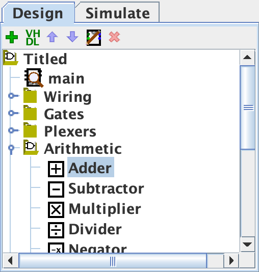

3. Выберите `Register` из библиотеки `Memory` и поместите один регистр в вашу подсхему. Ниже приведено изображение, иллюстрирующее части регистра.

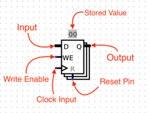

4. Подключите входной контакт `clk` к тактовому контакту вашего регистра.
В большинстве ситуаций лучше, чтобы все компоненты в схеме использовали один и 
тот же тактовый сигнал, чтобы все было синхронизировано.
В данном случае тестовое окружение использует тактовый сигнал для своего регистра,
поэтому оно передает его через вывод `clk` для регистров вашей схемы. В будущем, если вы работаете над схемой, у которой нет существующего тактового сигнала, вы можете создать свой собственный, используя новый `Clock` из библиотеки `Wiring`.
5. Подключите выход сумматора ко входу регистра, а выход регистра к входу сумматора.
    - При попытке подключения компонентов вы можете получить ошибку
   "Incompatible widths" (*Несовместимые ширины*).
   Это означает, что ваш провод пытается соединить два контакта с разной
   битовой шириной. Если вы щелкните на компонент с помощью инструмента `Selection` (значок указателя мыши на панели инструментов в верхней части окна), вы заметите, что в левом нижнем поле окна есть свойство `Data Bits`. Это значение определяет количество бит на входе и выходе компонента. Убедитесь, что и сумматор, и регистр имеют ширину бита данных 8, после чего ошибка "Incompatible widths" должна быть устранена.
6. Подключите 8-битную константу со значением `1` ко второму входу сумматора. Элемент цепи `Constant` можно найти в библиотеке `Wiring`. Чтобы изменить его значение на `1`, просто введите `1` в свойстве `Value` и нажмите `Enter`. Теперь вы должны увидеть значение `0x1` (Logisim автоматически преобразует введенное десятичное значение в шестнадцатеричное).
7. Подключите два выходных контакта к вашей схеме, чтобы вы могли контролировать то, что выходит из сумматора и регистра. Выход сумматора должен быть подключен к `ADD_OUT`, а выход регистра - к `REG_OUT`. Таким образом, в итоге ваша схема должна выглядеть следующим образом:

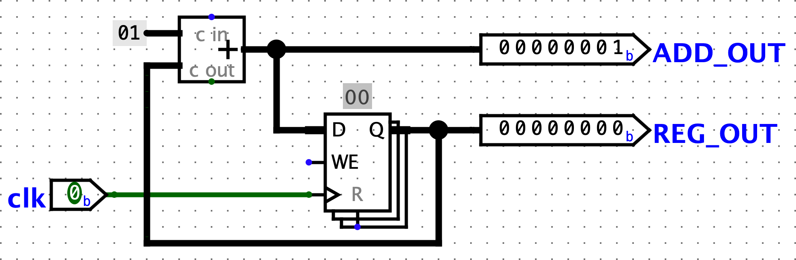

8. Теперь откройте тестовую схему для этого упражнения (`lab01/tests/ex2-test.circ`). В левом верхнем углу есть небольшая цепь (как ваша `AddMachine`), отслеживающая текущий цикл. Ниже вы должны увидеть цепь `AddMachine`, подключенную к тактовому сигналу и некоторым выходным контактам.
9. Запустите импульс на вашу цепь единожды, перейдя в `Simulate -> Tick Half Cycle` (`Command/Control + T`). Выходы из вашей `AddMachine` должны увеличиться! Кроме того, тактовый сигнал теперь должен отображаться ярко-зеленым.

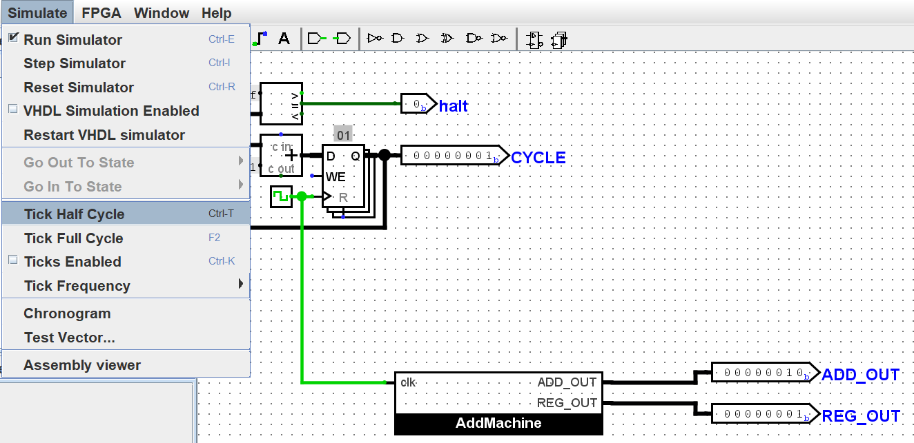

    Если вы запустите `Tick Half Cycle` ещё раз, вы увидите, что тактовый сигнал снова отображается тёмно-зелёным, но числа не изменяются. Так происходит, потому что регистры по умолчанию работают по принципу "срабатывания по нарастающей" (т.е. срабатывают при переходе от низкого сигнала к высокому)
    Если вы не заинтересованы в наблюдении изменений только для половины циклов, вы также можете использовать `Simulate -> Tick Full Cycle` (`F2`) для запуска тактовых импульсов для полного цикла.
10. Запускать импульсы на цепь вручную может быть довольно утомительно. Хорошие новости: Logisim может делать это за вас! Перейдите в `Simulate -> Ticks Enabled/Enable Clock Ticks` (`Command/Control + K`). Теперь через вашу цепь проходят импульсы автоматически!


    Если вы хотите, чтобы ваша цепь работала быстрее, вы можете изменить частоту тактов в `Simulate -> Tick Frequency`. Чтобы остановить, снова нажмите `Ticks Enabled//Enable Clock Ticks` (`Command/Control + K`). Если вы хотите сбросить цепь, `Simulate -> Reset Simulation` (`Command/Control + R`).
11. Когда вы закончите, попробуйте запустить предоставленные тесты [используя `pyhton3 test.py`](#§-тестирование).
 
### § Контрольная точка

С этого момента убедитесь, что вам удобно проектировать и моделировать в среде Logisim простые цифровые логические схемы, использующие сочетание *комбинационной логики* и *элементов состояния* (регистров).

---

## § Расширенные возможности Logisim

Здесь представлены три функции Logisim, которые помогут вам сэкономить много времени и сделать ваши схемы на вид намного опрятнее.

### § Разветвители (сплиттеры) 

Разветвители позволяют взять многобитовое значение и разделить его на мелкие части, или (несмотря на название) объединить несколько значений, состоящих из одного или нескольких битов, в одно значение. На следующем изображении мы разбиваем 4-битное двоичное число `1001` на `10` и `01`, затем объединяем его с `11` в окончательное 6-битное число `111001`:

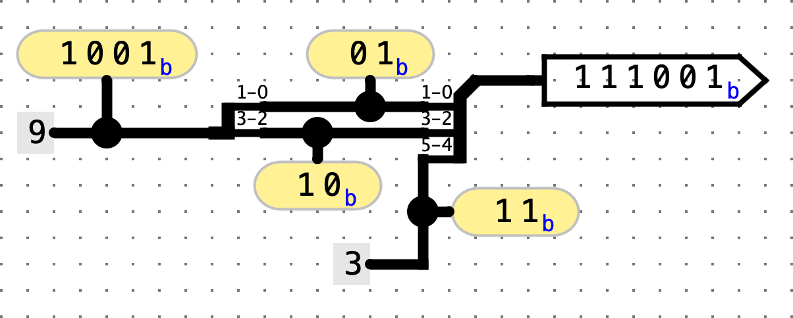

Щелкните на разветвитель (с помощью инструмента `Select`), чтобы получить его атрибуты на боковой панели (слева внизу). Вы можете настроить такие атрибуты, как количество плеч разветвителя и биты, присутствующие на каждом плече. На приведенной выше схеме атрибуты левого и правого разветвителей выглядят следующим образом:

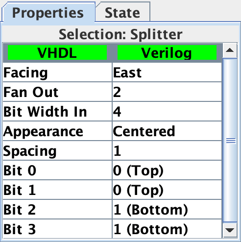
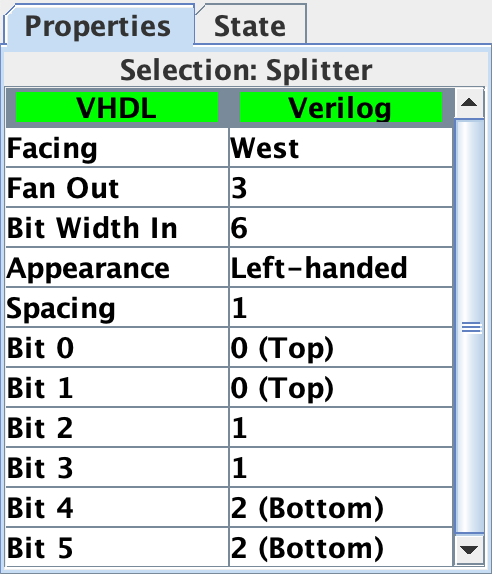

Обратите внимание, что существует атрибут под названием `Facing`. Его можно использовать для того, чтобы поворачивать разветвитель. В приведенном выше примере разветвитель справа обращен на `West` (*запад*), а разветвитель слева - на `East` (*восток*).

Если вы видите ошибочный провод оранжевого цвета, то это означает, что ширина входящего бита не соответствует ширине исходящего бита. Убедитесь, что при соединении двух компонентов проводом вы правильно установили ширину бита в меню этого компонента.

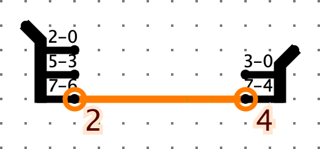

### § Туннели

Туннель позволяет нарисовать "невидимый провод", связывающий две точки вместе. Туннели группируются по меткам, присваиваемым проводу с учетом регистра. Они используются для соединения проводов следующим образом:

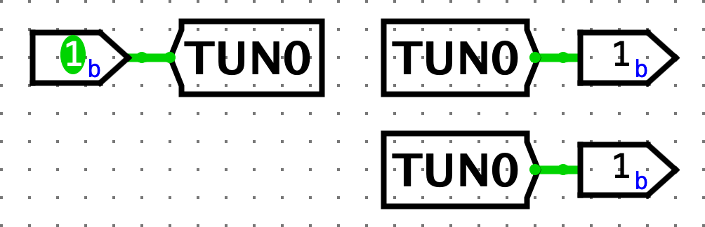

что, по сути, равносильно:

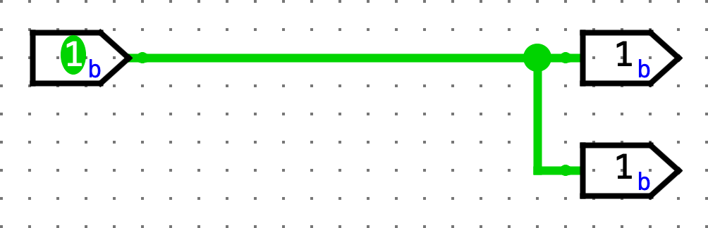

Следует проявлять некоторую осторожность в отношении того, какие провода соединяются туннелями с другими проводами, как, например, в этом случае:

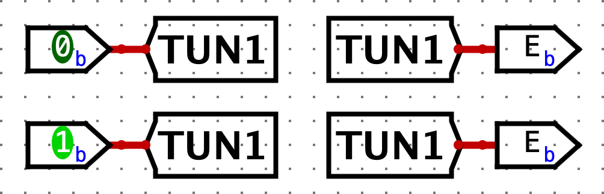

что, по сути, равносильно:

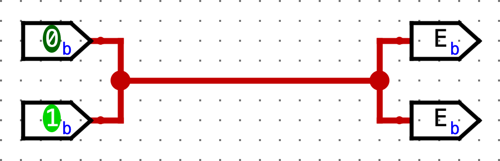

Мы *настоятельно* рекомендуем вам использовать туннели в Logisim, потому что они делают ваши схемы более опрятными на вид (меньше спагетти из проводов), что дает преимущество в более легкой отладке.

### § Расширители (экстендеры)

При изменении ширины провода для наглядности следует использовать расширитель битов. Например, рассмотрим следующую реализацию нулевого расширения 8-битного провода в 16-битный провод:

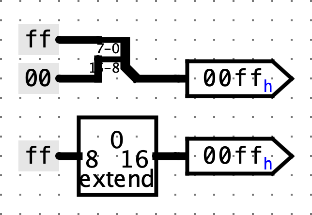

По сравнению с разветвителем, расширитель легче в понимании с первого взгляда. Это становится особенно полезным при работе со сложными цепями.

Кроме того, рассмотрим случай с выбрасыванием бит. Несмотря на свое название, расширитель может выполнять и эту операцию:

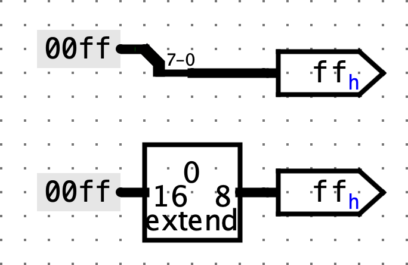

Хотя разветвитель более минималистичен, но также он немного сложнее для чтения.

---

## § Задание 3: Практика с разветвителями
Мы собираемся построить цепь, которая манипулирует 8-битным числом.

### § Ход работы
Выполните следующие шаги. Не забывайте как можно чаще **сохранять свою работу**, **не перемещайте** и **не редактируйте предоставленные контакты входа/выхода**.

1. Откройте `ex3.circ` и выберите пустую схему SplitThing.
2. Перейдите в библиотеку `Wiring` и выберите схему `Splitter`. Эта схема возьмет провод и разделит его на набор проводов меньшей ширины. И так же наоборот, она может взять много наборов проводов и объединить их в один.
3. Измените свойство `Bit Width In` (ширина шины) на `8`, а свойство `Fan Out` (количество ветвей) на `3`. Теперь выберите, какие биты посылать в какую часть вашей ветви. Наименее значимый бит - это бит `0`, а наиболее значимый - бит `7`. Бит `0` должен выходить на плечо ветви `0`, биты `1`, `2`, `3`, `4`, `5` и `6` должны выходить на плечо ветви `1`, а бит `7` должен выходить на плечо ветви `2`.
    - Опция `None` означает, что выбранный бит не будет выходить ни на одно из плеч ветви.
    - Если вы хотите изменить сразу несколько последовательных битов, щелкните на имя первого из них (не кол-во плеч), нажмите и удерживайте Shift, а затем щелкните на имя последнего. Все строки между ними должны быть выделены. Теперь измените количество плеч одного из битов, и все биты будут обновлены одновременно.
4. Подключите `INPUT0` к разветвителю. Подключите 2-входной вентиль `AND` к плечам ветви 0 и 2 и направьте выход вентиля `AND` на `OUTPUT0`.
5. Теперь, интерпретируя ввод как число с методом "знак и величина", разместите логические вентили и другие цепи так, чтобы `OUTPUT1` получил отрицательное значение ввода в виде метода "знак и величина". ["Знак и величина"](https://en.wikipedia.org/wiki/Signed_number_representations#Signed_magnitude_representation) (*англ. Sign and magnitude*) - это альтернативный способ представления знаковых значений такой же, как и дополнительный код (*англ. Two's complement*), но проще! Для комбинационной логики требуется очень мало вентилей. 
6. Нам потребуется другой разветвитель, чтобы рекомбинировать ветви в одну 8-битную шину. Разместите другой разветвитель с соответствующими свойствами (Bit Width In: 8, Fan Out: 3, верные ширины ветвей). "Поиграйте" со свойствами `Facing` и `Appearance`, чтобы сделать вашу окончательную схему как можно более опрятней на вид. На данном этапе `OUTPUT1` должен быть отрицанием ввода (если интерпретировать `INPUT0` И `OUTPUT1` как значения метода "знак и величина").
7. Если вы закончили, то попробуйте запустить предоставленные тесты.

### § Контрольная точка
Если мы решим взять вход и интерпретировать его как число дополнительного кода, какие входные данные произведут `OUTPUT0 = 1`? *Подсказка: Что говорят о числе первые и последние биты числа дополнительного кода, равные 1?

---

## Задания по вариантам.
Ниже представлены два упражнения по вариантам в них необходимо составить рабочие схемы ex4.circ и ex5.circ, решающие поставленную задачу.
Описания некоторых упражнений представлены в книге Харрис и Харрис `ЦИФРОВАЯ СХЕМОТЕХНИКА И АРХИТЕКТУРА КОМПЬЮТЕРА: RISC-V`

## § Задание 4: Реализация выражений булевой алгебры.

### Рис. 2.80 Таблица истинности


### Рис. 2.81 Таблица истинности
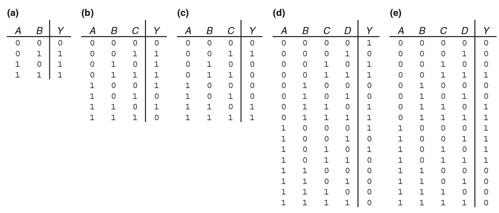

### Вариант 1.
1. Запишите логическое выражение в совершенной дизъюнктивной нормальной форме для таблицы истинности (a), приведенной на [рис. 2.80](#рис-280-таблица-истинности).
2. Минимизируйте полученное логическое выражение.
3. Составьте простую комбинационную схему, реализующую полученное выражение. Под простой схемой подразумевается такая, которая состоит из небольшого количества элементов, но при этом ее разработчик не тратит много времени на проверку каждой из возможных реализаций схемы.
4. Повторите пункт 3, используя только элементы НЕ, И и ИЛИ.

### Вариант 2.
1. Запишите логическое выражение в совершенной дизъюнктивной нормальной форме для таблицы истинности (b), приведенной на [рис. 2.80](#рис-280-таблица-истинности).
2. Минимизируйте полученное логическое выражение.
3. Составьте простую комбинационную схему, реализующую полученное выражение. Под простой схемой подразумевается такая, которая состоит из небольшого количества элементов, но при этом ее разработчик не тратит много времени на проверку каждой из возможных реализаций схемы.
4. Повторите пункт 3, используя только элементы НЕ, И и ИЛИ.

### Вариант 3.
1. Запишите логическое выражение в совершенной дизъюнктивной нормальной форме для таблицы истинности (a), приведенной на [рис. 2.81](#рис-281-таблица-истинности).
2. Минимизируйте полученное логическое выражение.
3. Составьте комбинационную схему, реализующую полученное выражение.
4. Повторите пункт 3, используя только элементы НЕ, И и ИЛИ.

### Вариант 4.
1. Запишите логическое выражение в совершенной дизъюнктивной нормальной форме для таблицы истинности (b), приведенной на [рис. 2.81](#рис-281-таблица-истинности).
2. Минимизируйте полученное логическое выражение.
3. Составьте комбинационную схему, реализующую полученное выражение.
4. Повторите пункт 3, используя только элементы НЕ, И и ИЛИ.

### Вариант 5.
1. Запишите логическое выражение в совершенной дизъюнктивной нормальной форме для таблицы истинности (a), приведенной на [рис. 2.80](#рис-280-таблица-истинности).
2. Минимизируйте полученное логическое выражение.
3. Составьте простую комбинационную схему, реализующую полученное выражение. Под простой схемой подразумевается такая, которая состоит из небольшого количества элементов, но при этом ее разработчик не тратит много времени на проверку каждой из возможных реализаций схемы.
4. Повторите пункт 3, используя только элементы НЕ, И-НЕ и ИЛИ.

### Вариант 6.
1. Запишите логическое выражение в совершенной дизъюнктивной нормальной форме для таблицы истинности (b), приведенной на [рис. 2.80](#рис-280-таблица-истинности).
2. Минимизируйте полученное логическое выражение.
3. Составьте простую комбинационную схему, реализующую полученное выражение. Под простой схемой подразумевается такая, которая состоит из небольшого количества элементов, но при этом ее разработчик не тратит много времени на проверку каждой из возможных реализаций схемы.
4. Повторите пункт 3, используя только элементы НЕ, И-НЕ и ИЛИ.

### Вариант 7.
1. Запишите логическое выражение в совершенной дизъюнктивной нормальной форме для таблицы истинности (a), приведенной на [рис. 2.81](#рис-281-таблица-истинности).
2. Минимизируйте полученное логическое выражение.
3. Составьте комбинационную схему, реализующую полученное выражение.
4. Повторите пункт 3, используя только элементы НЕ, И-НЕ и ИЛИ.

### Вариант 8.
1. Запишите логическое выражение в совершенной дизъюнктивной нормальной форме для таблицы истинности (b), приведенной на [рис. 2.81](#рис-281-таблица-истинности).
2. Минимизируйте полученное логическое выражение.
3. Составьте комбинационную схему, реализующую полученное выражение.
4. Повторите пункт 3, используя только элементы НЕ, И-НЕ и ИЛИ.

### Вариант 9.
1. Упростите следующее логическое выражение, используя теоремы булевой алгебры. Проверьте правильность результатов, используя таблицы истинности или карты Карно.

    $Y=AC+\bar{A} \bar{B} C$  

2. Составьте простую комбинационную схему, реализующую полученное выражение.

### Вариант 10.
1. Упростите следующее логическое выражение, используя теоремы булевой алгебры. Проверьте правильность результатов, используя таблицы истинности или карты Карно.

    $Y=\bar{A} \bar{B}+\bar{A} B \bar{C}+(\overline{A+\bar{C}})$    

2. Составьте простую комбинационную схему, реализующую полученное выражение.

### Вариант 11.
1. Упростите следующее логическое выражение, используя теоремы булевой алгебры. Проверьте правильность результатов, используя таблицы истинности или карты Карно.

    $Y=\bar{A} \bar{B} \bar{C} \bar{D}+A \bar{B} \bar{C}+A \bar{B} C \bar{D}+A B D+\bar{A} \bar{B} C \bar{D}+B \bar{C} D+\bar{A}$    

2. Составьте простую комбинационную схему, реализующую полученное выражение.

### Вариант 12.
1. Упростите следующее логическое выражение, используя теоремы булевой алгебры. Проверьте правильность результатов, используя таблицы истинности или карты Карно.

    $Y=\bar{A} B C+\bar{A} B \bar{C}$  

2. Составьте простую комбинационную схему, реализующую полученное выражение. 

### Вариант 13.
1. Упростите следующее логическое выражение, используя теоремы булевой алгебры. Проверьте правильность результатов, используя таблицы истинности или карты Карно.

    $Y=\overline{A B C}+A\bar{B}$

2. Составьте простую комбинационную схему, реализующую полученное выражение. 

### Вариант 14.

1. Упростите следующее логическое выражение, используя теоремы булевой алгебры. Проверьте правильность результатов, используя таблицы истинности или карты Карно.

    $Y=A B C \bar{D}+\overline{A B C D}+(\overline{A+B+C+D})$

2. Составьте простую комбинационную схему, реализующую полученное выражение. 

### Вариант 15.
* Упростите следующее логическое выражение. Составьте простую комбинационную схему, реализующую полученное выражение.

    $Y=B C+\bar{A} \bar{B} \bar{C}+B \bar{C}$

### Вариант 16.
* Упростите следующее логическое выражение. Составьте простую комбинационную схему, реализующую полученное выражение.

    $Y=\overline{A+\bar{A} B+\bar{A}} \overline{\bar{B}}+\overline{A+\bar{B}}$

### Вариант 17.
* Упростите следующее логическое выражение. Составьте простую комбинационную схему, реализующую полученное выражение.

    $Y=A B C+A B D+A B E+A C D+A C E+(\overline{A+D+E})+\bar{B} \bar{C} D+\bar{B} \bar{C} E+\bar{B} \bar{D} \bar{E}+\bar{B} \bar{D} \bar{E}$

### Вариант 18.
* Упростите следующее логическое выражение. Составьте простую комбинационную схему, реализующую полученное выражение.

    $Y=\bar{A} B C+\overline{B \bar{C}}+B C$

### Вариант 19.
* Упростите следующее логическое выражение. Составьте простую комбинационную схему, реализующую полученное выражение.

    $Y=(\overline{A+B+C}) D+A D+B$

### Вариант 20.
* Упростите следующее логическое выражение. Составьте простую комбинационную схему, реализующую полученное выражение.

    $Y=A B C D+\bar{A} B \bar{C} D+(\overline{\bar{B}+D}) E$

---

## § Задание 5, Вариант 1: Реализация сложных комбинационных схем.
Требуется реализовать нетривиальный блок комбинационной логики: `RotRight`, 
что означает "Rotate Right" (Поворот вправо). Идея заключается в том, что 
`RotRight` будет "поворачивать" битовый шаблон входа `INPUT0` вправо на `AMOUNT`
(Количество) бит. Таким образом, если `INPUT0` был бы `0b1000000000000101`, а 
`AMOUNT` был бы `0b0011` (`3` в десятичном формате), вывод блока был бы 
`0b1011000000000000`. Обратите внимание, что крайние 3 бита были повернуты от
правого конца значения к левому. Это можно представить как побитовую операцию 
`R = A >> B | A << (16 - B)`.
### § Ход работы
Реализуйте подсхему с названием RotRight со следующими входами:

 - `INPUT0` (16-бит) 16-битный вход, который необходимо повернуть
 - `AMOUNT` (4-бит) количество оборотов (почему 4 бита?)
 
Выполните следующие шаги. Не забывайте как можно чаще **сохранять свою работу**.

В качестве выхода должен быть `INPUT0`, повернутый вправо на `AMOUNT` бит, как описано выше. Вам **НЕ** разрешается использовать в вашем решении шифтеры Logisim, хотя вся остальная комбинационная логика (MUX'ы, константы, вентили, сумматоры и т.д.) разрешена. Особенно полезными могут оказаться встроенные в Logisim MUX'ы  (их можно найти в меню `Plexers`). Ваше решение не должно включать такты или какие-либо элементы с тактовой частотой, например, регистры.

 - До того, как вы приступите к подключению, вам следует хорошо подумать о том, как разложить эту задачу на более мелкие задачи, а затем соединить их вместе. Вы можете **использовать подсхемы** при реализации `RotRight` Если вы этого не сделаете, все может усложниться.
 - То, что операция представляется в виде побитовой операции, не означает, что это лучший способ решения задачи. Подумайте о входных битах `B` и подумайте о том, как можно эффективно использовать разветвители! Можете ли вы что-то сделать с двоичной формой? Вспомните, почему двоичная форма удобна для использования в компьютерах: 1 легко представить как сигнал `ON`, а `0` - как сигнал `OFF`. Допустим, мы хотим повернуть `9` раз. `9` - это `1001` в двоичном формате, или `1*8 + 0*4 + 0*2 + 1*1`. Можете ли вы использовать это для создания более чистой цепи? Использование предоставленных нами схем rot* - это хорошая идея, которая позволит сохранить чистоту в нашей работе!

## § Задание 5, Вариант 2: Реализация сложных комбинационных схем.
Задание аналогично Варианту 1, но требуется реализовать поворот влево. Соответствующая операция:
`L = A << B | A >> (16 - B)`.
### § Ход работы
Реализуйте подсхему с названием RotLeft со следующими входами:

 - `INPUT0` (16-бит) 16-битный вход, который необходимо повернуть
 - `AMOUNT` (4-бит) количество оборотов (почему 4 бита?)
 
Выполните следующие шаги. Не забывайте как можно чаще **сохранять свою работу**.

В качестве выхода должен быть `INPUT0`, повернутый влево на `AMOUNT` бит, как описано выше. Вам **НЕ** разрешается использовать в вашем решении шифтеры Logisim, хотя вся остальная комбинационная логика (MUX'ы, константы, вентили, сумматоры и т.д.) разрешена. Особенно полезными могут оказаться встроенные в Logisim MUX'ы  (их можно найти в меню `Plexers`). Ваше решение не должно включать такты или какие-либо элементы с тактовой частотой, например, регистры.

## § Задание 5, Вариант 3: Реализация сложных комбинационных схем.
Выполните Упражнение 2.25 из книги Харрис и Харрис `ЦИФРОВАЯ СХЕМОТЕХНИКА И АРХИТЕКТУРА КОМПЬЮТЕРА: RISC-V`-

1. Напишите логические выражения для схемы, показанной на следующем рисунке:  
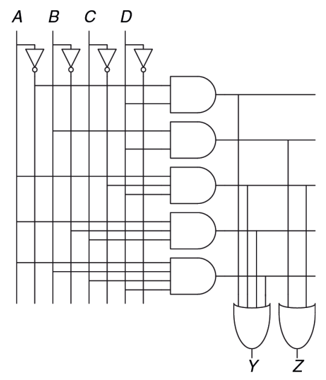   
2. Минимизируйте логические выражения, полученные ранее.
3. Нарисуйте усовершенствованную схему, реализующую эти функции.

## § Задание 5, Вариант 4: Реализация сложных комбинационных схем.
Выполните Упражнение 2.34 (a) из книги Харрис и Харрис `ЦИФРОВАЯ СХЕМОТЕХНИКА И АРХИТЕКТУРА КОМПЬЮТЕРА: RISC-V`

1. Завершите разработку дешифратора семисегментного индикатора для сегментов от $S_{c}$ до $S_{g}$ (см. упр 2.10 из Харрис и Харрис)

2. Запишите логическое выражение для выходов от $S_{c}$ до $S_{g}$ при условии, что при подаче на вход значения более 9 выход должен быть нулем.

## § Задание 5, Вариант 5: Реализация сложных комбинационных схем.
Выполните Упражнение 2.34 (b) из книги Харрис и Харрис `ЦИФРОВАЯ СХЕМОТЕХНИКА И АРХИТЕКТУРА КОМПЬЮТЕРА: RISC-V`

1. Завершите разработку дешифратора семисегментного индикатора для сегментов от $S_{c}$ до $S_{g}$ (см. упр 2.10 из Харрис и Харрис)

2. Запишите логическое выражение для выходов от $S_{c}$ до $S_{g}$ при условии, что при подаче на вход значения более 9 состояние выхода безразлично.

## § Задание 5, Вариант 6: Реализация сложных комбинационных схем.
Выполните Упражнение 2.34 (c) из книги Харрис и Харрис `ЦИФРОВАЯ СХЕМОТЕХНИКА И АРХИТЕКТУРА КОМПЬЮТЕРА: RISC-V`

1. Завершите разработку дешифратора семисегментного индикатора для сегментов от $S_{c}$ до $S_{g}$ (см. упр 2.10 из Харрис и Харрис)

2. Нарисуйте простую реализацию на уровне логических элементов для
случая (b). При необходимости используйте общие логические элементы для нескольких выходов.

## § Задание 5, Вариант 7: Реализация сложных комбинационных схем.
Выполните Упражнение 2.35 из книги Харрис и Харрис `ЦИФРОВАЯ СХЕМОТЕХНИКА И АРХИТЕКТУРА КОМПЬЮТЕРА: RISC-V`

* Схема имеет четыре входа и два выхода. На входы $A_{3:0}$ подается число от 0 до 15. Выход $P$ должен быть равен ИСТИНЕ, если число на входе простое (0 и 1 не являются простыми, а 2, 3, 5 и так далее – являются). Выход $D$ должен быть равен ИСТИНЕ, если число делится на 3. Запишите упрощенное логическое выражение для каждого из выходов и нарисуйте схему.

## § Задание 5, Вариант 8: Реализация сложных комбинационных схем.
Выполните Упражнение 2.36 из книги Харрис и Харрис `ЦИФРОВАЯ СХЕМОТЕХНИКА И АРХИТЕКТУРА КОМПЬЮТЕРА: RISC-V`

Приоритетный шифратор имеет $2^N$ входов. Он формирует на $N$-разрядном выходе номер самого старшего входного бита, который принимает значение ИСТИНА. Он также формирует на выходе NONE значение ИСТИНА, если ни один из входов не принимает значение ИСТИНА. Разработайте восьмивходовый приоритетный шифратор с входом $A_{7:0}$ и выходами $Y_{2:0}$ и NONE. Например, если вход $A$ принимает значение 00100000, то выход $Y$ должен быть 101, а NONE – 0. Запишите упрощенное логическое выражение для каждого из выходов и нарисуйте схему.


## § Задание 5, Вариант 9: Реализация сложных комбинационных схем.
Выполните Упражнение 2.37 из книги Харрис и Харрис `ЦИФРОВАЯ СХЕМОТЕХНИКА И АРХИТЕКТУРА КОМПЬЮТЕРА: RISC-V`

Разработайте модифицированный приоритетный шифратор ([упр. 6, вар. 8](#§-упражнение-6-вариант-8-реализация-сложных-комбинационных-схем)), который имеет 8-разрядный вход $A_{7:0}$, а также 3-разрядные выходы $Y_{2:0}$ и $Z_{2:0}$. На выходе $Y$ формируется номер самого старшего входного бита, который принимает значение ИСТИНА. На выходе $Z$ формируется номер второго по старшинству входного бита, который принимает значение ИСТИНА. $Y$ принимает значение 0, если все биты входа – ЛОЖЬ. $Z$ принимает значение 0, если только один бит входа – ИСТИНА. Запишите упрощенное логическое выражение для каждого из выходов и нарисуйте схему.

## § Задание 5, Вариант 10: Реализация сложных комбинационных схем.
Выполните Упражнение 2.38 из книги Харрис и Харрис `ЦИФРОВАЯ СХЕМОТЕХНИКА И АРХИТЕКТУРА КОМПЬЮТЕРА: RISC-V`

$M$-битный унарный код числа $k$ содержит $k$ единиц в младших разрядах и $(M-k)$ нулей во всех старших разрядах. Преобразователь бинарного кода в унарный имеет N входов и $\left(2^{N}-1\right)$ выходов. Он формирует $\left(2^{N}-1\right)$-битный унарный код для числа, установленного на входе. Например, если на входе 110, то на выходе должно быть 0111111. Разработайте преобразователь трехбитного бинарного кода в семибитный унарный. Запишите логическое выражение для каждого из выходов и нарисуйте схему.

[Вентиль AND]: <figs/icon-and.png>
[Входной контакт]: <figs/icon-pin-input.png>
[Выходной контакт]: <figs/icon-pin-output.png>
[Инструмент "Выбор"]: <figs/icon-select.png>
[Инструмент "Щуп"]: <figs/icon-poke.png>