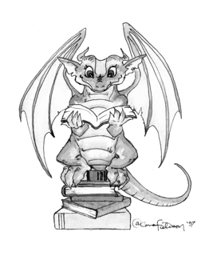
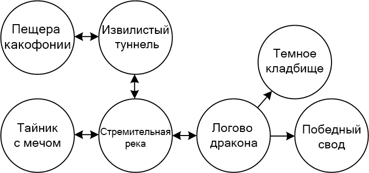

# Лабораторная работа №2.2: Разработка поведенческой модели конечного автомата

## Цель
Цель этого задания заключается в разработке конечного автомата, используя поведенческий SystemVerilog. Помимо этого, вы должны написать свой собственный самопроверяющийся тестовый стенд, а затем отладить вашу разработку. Вам не потребуется загружать свою разработку на ПЛИС-устройство.

В этой лабораторной работе вы будете разрабатывать КА, который реализует приключенческую игру (адвенчур). Вам понадобится написать тестовый стенд, для реализации ввода в игру.

## 1. Приключенческая игра
Приключенческая игра-квест, которую вы будете разрабатывать, имеет семь комнат и один объект - меч. Игра начинается в локации "Пещера какофонии". Чтобы пройти игру, вы сначала должны последовать на восток через локацию "Извилистый туннель", а затем на юг к "Стремительной реке". После чего, на западе в локации "Тайник с мечом" вы должны найти "Вострый меч". Меч позволит вам безопасно пройти на восток от "Стремительной реки" через "Логово дракона" в локацию "Победный свод", и на этом моменте вы с победой завершите игру. Если же вы пойдете через "Логово дракона" без "Вострого меча", то будете повержены опасным драконом и будете брошены на "Тёмное кладбище", где игра завершится с поражением. Игра останется на кладбище или в победном своде до тех пор, пока вы не перезапустите её. Общая карта игры показана на следующем изображении.

Игра может быть реализована при помощи двух конечных автоматов, которые коммуницируют друг с другом. Один КА следит за тем, в какой комнате вы сейчас находитесь, а другой КА следит за тем, есть ли у вас на текущий момент времени меч или же нет. КА должны взаимодействовать друг с другом.

- Составьте диаграмму переходов состояний для каждого КА. КА должны получать асинхронный перезапуск и такт. Системные вводы - N (север), S (юг), E (восток) и W (запад), соответствующие четырем направлениям. Система должна производить два вывода - WIN (победа) и DIE (поражение). КА комнат должен иметь состояние для каждой комнаты и переходы, основанные на направлениях, по которым вы можете двигаться. Предположим, что игрок будет делать точно один ввод на каждый цикл и никогда не сделает недопустимый ввод. 
- Напишите поведенческий SystemVerilog для вашей системы. Обязательно подумайте о том, какое оборудование вам нужно, и напишите соответствующую идиому, а не подходите к этому как к упражнению по программированию. У вас должен быть один модуль для каждого КА и один модуль верхнего уровня, соединяющий их вместе.

Когда вы описываете комбинационную логику для следующего состояния, запомните, что вы всегда должны указывать следующее состояние. Предположение о том, что игрок каждый цикл делает верный ввод, позволяет несколько упростить процесс. Например, когда вы находитесь в "Пещере какофонии", то следующим состоянием обязательно будет "Извилистый туннель".

- Напишите самопроверяющийся тестовый стенд и тестовые векторы, чтобы поиграть в эту приключенческую игру. Предоставьте один набор векторов, который демонстрирует оба случая - поражение и победу. Вам нужно будет соответствующим образом генерировать сброс между играми; для этого существуют различные способы. 
- Запустите симуляцию, показывающую все вводы и вводы, а также текущую комнату. Для просмотра осциллограмм в ModelSim, которые не находятся на верхнем уровне, вам нужно перейти к соответствующей ячейке в иерархии в верхней левой панели, чтобы увидеть сигналы в этой ячейке. Разверните `testbench`, чтобы увидеть `dut`, а затем разверните его, чтобы увидеть другие подмодули, такие как КА `room` и КА `sword`. Например, добавьте внутренний сигнал, указывающий текущую комнату к вашим осциллограммам.
- Взгляните на синтезированную схему в вашем RTL Viewer и убедитесь, что она совпадает с вашими ожиданиями. Нажмите на каждый из ваших КА и посмотрите на схемы или диаграмму состояний, а затем снова убедитесь, что они совпадают с вашими ожиданиями.

## Что нужно сдать
1. Пожалуйста, укажите, сколько часов вы потратили на эту лабораторную работу. Это будет полезно для калибровки объема работы на следующем курсе.
2. Диаграммы перехода состояний для обоих КА.
3. Код поведенческого SystemVerilog для системы.
4. Тестовый стенд и тестовые векторы, демонстрирующие оба случая - поражение и победу.
5. Симуляционные осциллограммы, включающие вводы, выводы и текущую комнату. Прошли ли они ваш тестовый стенд и совпадают ли с вашими ожиданиями?
6. Схемы RTL Viewer (включая каждый КА). Совпадают ли они с вами ожиданиями?
7. ЗАДАНИЕ ПО ВАРИАНТАМ: Расширьте свою игру, добавив больше интересных комнат или предметов. Варианты можете получить у преподавателя.

