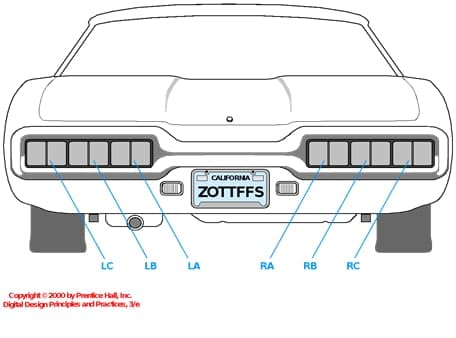
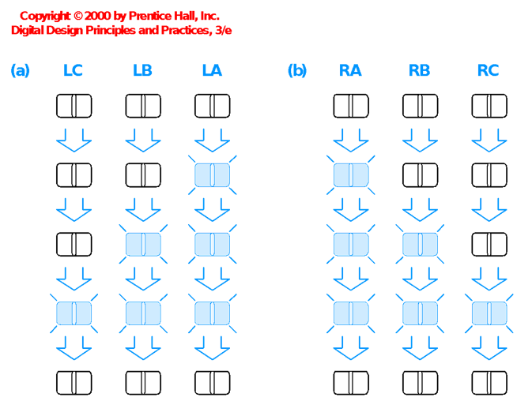

# Лабораторная работа №2.1. Разработка структурного описания конечного автомата

## Цель задания

Цель задания заключается в том, чтобы разработать конечный автомат, используя **структурный** SystemVerilog и отладить его в симуляции при помощи самопроверяющегося тестового стенда.

## Указатели поворота Thunderbird

Ваше задание для этой лабораторной работы заключается в разработке конечного автомата в SystemVerilog для контроля задних огней автомобиля 1965 г. Ford Thunderbird. На каждой стороне есть три огня, которые зажигаются последовательно, тем самым указывая направление поворота. На [рис. 1](#рис-1-задние-огни-thunderbird) показаны задние огни автомобиля, а на [рис. 2](#рис-2-последовательность-зажигания-огней) показана последовательность мигания для левых огней (a) и правых огней (b).


### **Рис. 1: Задние огни Thunderbird**
  


### **Рис 2: Последовательность зажигания огней (Вариант 1)**
  

КА должен иметь два входных контакта, левый и правый, которые запускают последовательность мигания в цикле после их включения. В любой момент времени включется только один из двух входов (левый или правый). КА должен иметь шесть выходных контактов, LA, LB, LC, RA, RB и RC. После запуска последовательности она должна продолжаться, даже если сигнал на входе сброше. Когда последовательность завершится, она должна на цикл вернуться в состояние с выключенными огнями, прежде чем можно будет начать другую последовательность. Пример ожидаемого поведения см. в файле тестового вектора Thunderbird далее в этой лабораторной работе. Вы должны получить свой вариант последовательности у преподавателя.

- Получите у преподавателя свой вариант включения поворотных сигналов. Составьте тестовые векторы.
- Составьте диаграмму переходов состояний для вашего КА. Будьте внимательны и точно следуйте приведенной выше спецификации, поскольку вам придется повторить все последующие шаги, если ваша диаграмма окажется неправильной. 
- Выберите кодировку состояний и напишите логические уравнения для следующего состояния и выходной логики. Сложность этого задания сильно зависит от выбранного вами кодирования состояний. 
- Составьте схему.
- Напишите **структурный код SystemVerilog** для вашего КА. Ваш структурный SystemVerilog Должен состоять из логических вентилей и триггеров (flip-flops), а не блоков `always`, логических уравнений или других высокоуровневых конструкций. Вы должны написать хотя бы один поведенческий модуль Verilog для определения сбрасываемого или устанавлеваемого триггера. Используйте код триггера из книги. Ваш КА должен иметь следующее объявление модуля:

```verilog
module lab2_xx(input logic clk,
               input logic reset,
               input logic left, right,
               output logic la, lb, lc, ra, rb, rc);
```

где `xx` - номер варианта. Вы можете предположить, что `clk` работает на желаемой скорости (например, около 1 Гц)

- Смоделируйте свой КА с помощью следующего самопроверяющегося тестового стенда и векторов. Изучите тестовый стенд и проследите, как он применяет входы и проверяет выходы. Отладьте любые вашего модуля. 

Вероятно, поначалу у вас будут возникать ошибки. Привыкайте интерпретировать сообщения из ModelSim и исправляйте любые ошибки. На самом деле, это хорошо, если у вас возникнут ошибки сейчас, в этой лабораторной работе, поскольку легче научиться отладке сейчас, чем потом, когда вы будете работать с более крупной системой!

---

```verilog
module testbench(); 
  logic        clk, reset;
  logic        left, right, la, lb, lc, ra, rb, rc;
  logic [5:0]  expected;
  logic [31:0] vectornum, errors;
  logic [7:0]  testvectors[10000:0];

// инстанцировать тестируемое устройство 
lab2_xx dut(clk, reset, left, right, la, lb, lc, ra, rb, rc); 

// generate clock 
always 
  begin
    clk=1; #5; clk=0; #5; 
  end 

// на старте теста, загрузите вектора и запустите сброс
initial 
  begin
    $readmemb("thunderbird.tv", testvectors); 
    vectornum = 0; errors = 0; reset = 1; #22; reset = 0; 
  end 

// применение тестовых векторов по нарастающему фронту тактового сигнала
always @(posedge clk) 
  begin
    #1; {left, right, expected} = testvectors[vectornum]; 
  end 

// проверка результатов по спадающему фронту сигнала clk
always @(negedge clk) 
  if (~reset) begin    // skip during reset
    if ({la, lb, lc, ra, rb, rc} !== expected) begin // check result 
      $display("Error: inputs = %b", {left, right});
      $display(" outputs = %b %b %b %b %b %b (%b expected)", 
        la, lb, lc, ra, rb, rc, expected); 
      errors = errors + 1; 
    end
    vectornum = vectornum + 1;
    if (testvectors[vectornum] === 8'bx) begin 
      $display("%d tests completed with %d errors", vectornum, errors); 
      $stop; 
    end 
  end 
endmodule 
```

Ниже предложен вариант тестовых векторов
---

```
// thunderbird.tv Вариант 1
// left right _  la lb lc ra rb rc
00_000000
10_000000
10_100000
10_110000
10_111000
10_000000
10_100000
00_110000
01_111000
01_000000
01_000100
00_000110
00_000111
00_000000
```

---

- Просинтезируйте ваш КА. Взгляните на **RTL Viewer**. Совпадает ли он с вашими ожиданиями?
- Назначьте контакты. Используйте [ползунки-переключатели](#примечание) для сбрасывания, левого и правого, кнопочный переключатель для `clk`, а также `LED`'ы для шести выходов. Пересинтезируйте КА с назначенными контактами.
- Посмотрите на отчёт о компиляции в **Quartus Flow Summary**. Найдите число регистров и контактов, которое использует данная разработка. 
- В секции **Analysis & Synthesis** взгляните на сводку об использовании ресурсов. Проверьте, что число регистров и I/O-контактов соответствуют вашим ожиданиям.

## Что нужно сдать

1. Пожалуйста, укажите сколько часов вы потратили на эту лабораторную работу. Это будет полезно для калибровки объема работы на следующем курсе.
2. Диаграмма переходов состояний.
3. Кодировка состояний и логические уравнения для следующего состояния и выхода.
4. Составленная схема
5. Структурный код SystemVerilog
6. Осциллограммы моделирования (waveforms), показывающие входы и выходы КА.  Прошел ли он самопроверку в тестбенче?
7. Схемы RTL Viewer. Совпадают ли они с вашими ожиданиями?

Пожалуйста, укажите все ошибки, который вы нашли в этой инструкции по лабораторной работе или ваши любые предложения по улучшению.


