# Лабораторная работа №2.0. Знакомства с инструментами разработки на языке SystemVerilog.

## 1. Руководство: Инструменты ПЛИС ALtera
Это разогревочное задание, призванное вас познакомить с процессом разработки устройств на ПЛИС. Если вы считаете, что разберетесь с инструментам разработки по ходу, то можете его пропустить.
Весь процесс состоит из следующих шагов:
- Написание кода устройства,
- Написание тестов,
- Тестирование устройства в симуляции,
- Анализ осцилограмм устройства,
- Синтез устройства,
- Программирование ПЛИС схемой устройства (не рассматриваем),
- Тестирование устройства на ПЛИС (не рассматриваем).
Ниже приведен вариант выполнения работы при помощи ПО ALtera/Intel Quartus Prime (Версия 18 является актуальной на момент написания) и тестовой платы ALtera DE0-CV с микросхемой Cyclone V 5CEBA4F23C7N [*(примечание-1)*](#примечание-1). Вы можете загрузить и установить программное обеспечение на ваш собственный ПК под управлением ОС Windows или MacOS, при желании, можно будет использовать плату DE0-CV. Однако, вы можете использовать и браузерный инструмент разработки [EDA Playground](https://www.edaplayground.com).

В этом задании вы возьмете полный сумматор, просимулируете его в ModelSim, а затем синтезируете для платы DE0-CV. При наличии платы, вы можете подключить три переключателя для ввода и два светодиода для вывода и проверите правильность работы схемы.

Шаги задания следующие:

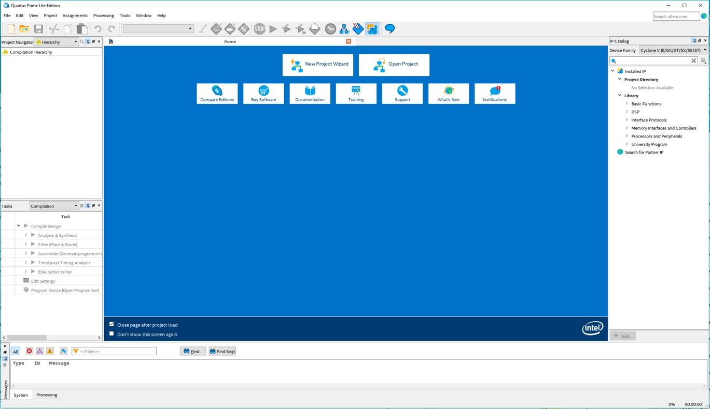  
**Изображение 1. Открыть Quartus Prime Lite**         
- На экране Directory, Name, Top-Level Entry, измените текущее рабочее место проекта, переместив его в папку, которую вы создали, а затем измените название проекта на любое подходящее, к примеру lab2_XX. Установите в качестве названия для top-level design entity (верхнеуровная структура разработки) - **fulladder**. 

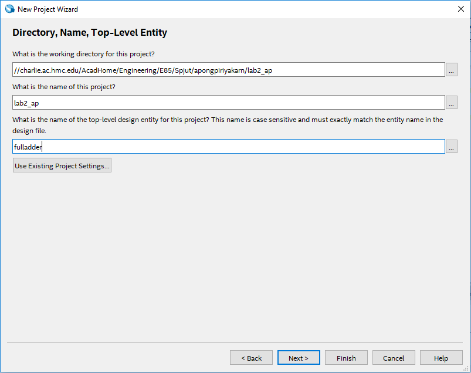
**Изображение 2. New Project Wizard**
- Нажмите **Next**. На экране Project Type, выберете **Empty project**, а затем снова нажмите **Next**.
- Нажмите **Next** на странице Add Files, так как у нас нет файлов, которые мы могли бы добавить. На следующей странице будет задана конкретная ПЛИС, на которую будет нацелен инструмент.
- Выберите **Pin Count → 484**, затем **Device → Cyclone V E Base**, это значительно сократит выборы. Нажмите **5CEBA4F23C7** в доступных устройствах, а затем нажмите Next.  

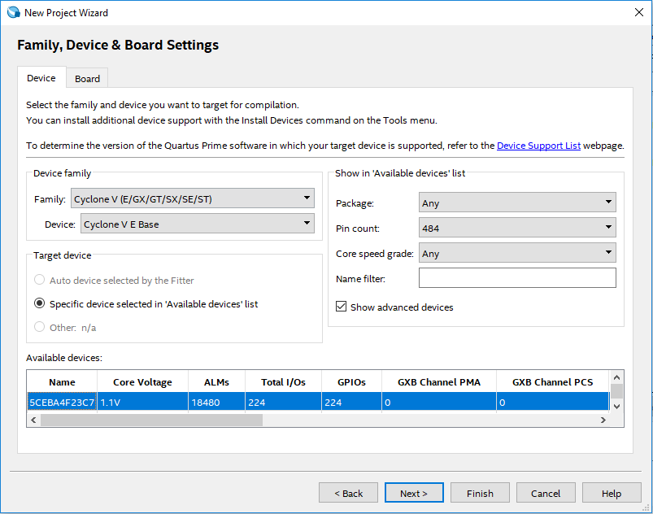
**Изображение 3. Выберите целевую ПЛИС**
- На следующей странице, измените **Simulation** на **ModelSlim-Altera** и **Format** на **SystemVerilog HDL**, нажмите Next, а затем Finish. 

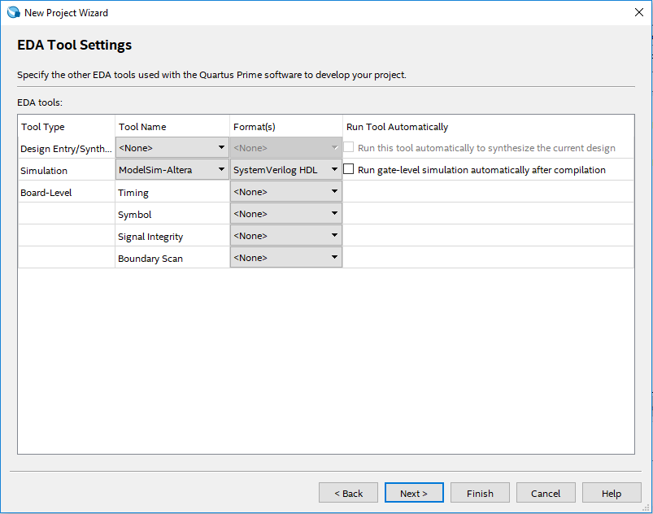
**Изображение 4. Setting ModelSim и Setting ModelSim**

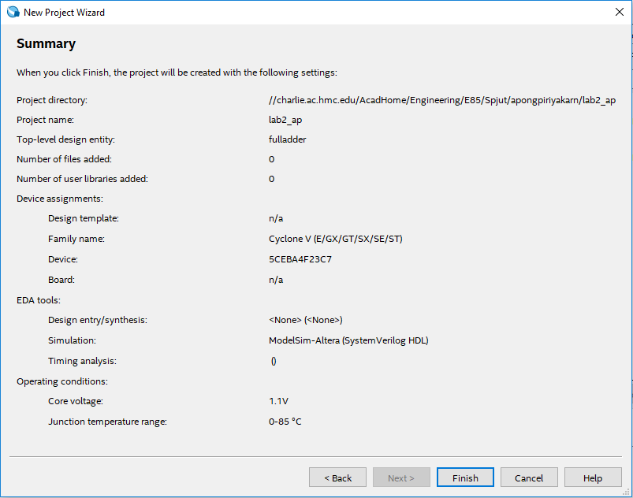
**Изображение 5. Project Summary**

В этом задании мы создадим полный сумматор.

- Выберите **File → New → SystemVerilog HDL File**.


**Изображение 6. Создание нового SystemVerilog HDL файла**

- Введите HDL ниже для полного сумматора в файл. Хотя, это и не обязательно, но может быть полезнее набрать код, а не копировать и вставлять его, чтобы освоиться с SystemVerilog. Затем, сохраните файл под именем fulladder.sv в директории la2_xx.
          
```verilog
// Поведенческий Verilog объясняет взаимоотношения между вводами и выводами
// К примеру: assign y = a & b;
// Структурный Verilog описывает структуры сформированные более простыми компонентами
// К примеру: and g1(y, a, b);
// Разделы 4.1-4.3 в книге (начиная со стр. 171) описывают эти 
// различия в деталях

// Этот модуль структурный или поведенческий?
module fulladder(input  logic a, b, cin,
		     output logic sum, cout);
	
	// Объявить 5 внутренних логических сигналов или локальных переменных, 
	// которые могут использоваться только в пределах этого модуля
	logic ns, n1, n2, n3, n4;
	
	// Следующие логические вентили являются частью спецификации SystemVerilog
	// (встроенные примитивы).
	// Первый сигнал (к примеру, ns) является выводом. Остальные(e.g., a, b) являются 
	// вводами.

	// sum logic
	xor x1(ns, a, b);		// ns = a XOR b
	xor x2(sum, ns, cin);	// sum = ns XOR cin
	
	// carry logic
	and a1(n1, a, b);		// n1 = a & b
	and a2(n2, a, cin);		// n2 = a & cin
	and a3(n3, b, cin);		// n3 = b & cin
	or o1(n4, n1, n2);		// n4 = n1 | n2
	or o2(cout, n3, n4);	// cout = n3 | n4

// Этот пример является структурным Verilog'ом, поскольку модуль описан 
// структурно, используя более фундаментальные блоки построения 
endmodule
________________________________________

```

## 1.1 Синтез
Имея законченный код, теперь мы можем синтезировать его в аппаратное обеспечение. Quartus Prime называет этот процесс компиляцией.
- Выберите **Processing → Start Compilation** (или нажмите на стрелочку Start Compilation , а далее на иконку STOP). Следите за тем, выдает ли программа предупреждения , критические предупреждения , ошибки , и другие показатели на нижней панели. Хорошей привычкой является запоминать какие предупреждения нормальные и искать причины ненормальных предупреждений, которые могут быть сигналом неполадок, на отладку которых в противном случае ушли бы часы.
В дополнение к другим предупреждениям, вы должны получить критическое предупреждение о том, что контакты не были назначены. Теперь вам нужно назначить соответствующие контакты, чтобы сигналы вашей схемы подключались к нужным переключателям и светодиодам на плате.  
- Взгляните на секцию 3.2, начинающуюся со страницы 21 [руководства пользователя DE0-CV](https://www.terasic.com.tw/cgi-bin/page/archive.pl?Language=English&CategoryNo=163&No=921&PartNo=4) для того, чтобы просмотреть номера контактов ПЛИС для каждой функции, включая кнопки, ползунковые переключатели и светодиоды на плате.
Теперь, когда синтез запущен, Quartus знает, какие сигналы используются вашим высокоуровневым модулем, так что вы можете назначить их для контактов. Давайте назначим вводы "a", "b", и "c" к "SW0", "SW1", и "SW2". Руководство показывает нам, что SW0 - это PIN_U13 на вашем ПЛИС.

- Выберите **Assigments → Pin planner** и установите **Location** для ввода "a" в PIN_U13. Аналогично, установите "b" в PIN_V13, а "cin" в PIN_T13. Подключите "sum" к LEDR0 (PIN_AA2), а для "cout" найдите назначение вывода LEDR1. Затем закройте Pin Planner и выполните синтез снова. Вы должны увидеть два критических предупреждения о том, что файл *Synopsys Design Constraints File* не найден, потому что у вас не указаны требования для временных характеристик вашей схемы, однако критические предупреждения о назначении контактов должны исчезнуть. Остальная часть лабораторной работы должна работать правильно даже с тем набором предупреждений, который остался. Файл [QuartusFulladderCompOut.txt](http://pages.hmc.edu/spjut/E85/DSM/QuartusFulladderCompilationOutput.txt) на веб-сайте содержит типичный вывод на данном этапе. Если у вас *много* свободного времени, вы можете увидеть, насколько много оставшихся предупреждений вы можете убрать.

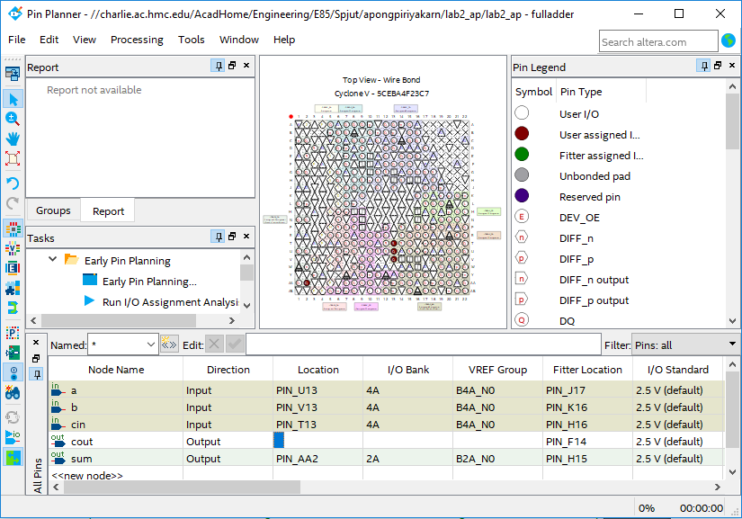
**Изображение 7. Pin Planner (Планировщик контактов)**

## 1.2 RTL Viewer
Теперь мы можем взглянуть на то, что создал синтезатор используя просмотрщик уровня регистровых передач (RTL). 
- Выберите **Tools → Netlist viewer → RTL Viewer**. Вы должны увидеть следующую схему, которая соответствует нашему коду.  
  
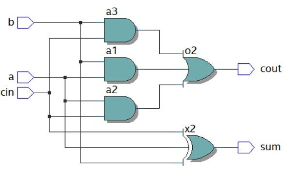   
**Изображение 8. RTL Viewer**

## 1.3 Симуляция
Далее, мы проведем симуляцию нашей схемы чтобы убедиться, что она выполняет требуюемую функцию. Лучший способ симуляции является использование самопроверяющего тестового стенда (testbench), написанного на языке SystemVerilog. Тестовый стенд подает входные сигналы и проверяет соответствие выходных сигналов ожиданиям. Если вы обнаружили ошибку, вы можете исправить проект и повторно запустить моделирование для проверки. Это делает процесс менее утомительным и снижает риск внесения ошибок при выполнении моделирования и проверке результатов вручную.
SystemVerilog поддерживает как моделирование аппаратуры (синтезируемое подмножество), так и тестовые стенды (несинтезируемое подмножество), но вам придется быть осторожными, чтобы не использовать конструкции тестового стенда, когда вы собираетесь описывать аппаратуру.
- Создайте новый файл SystemVerilog и введите следующий код в него. Комментарии можно не копировать. Вы можете скопировать/вставить код или напечатать его самостоятельно. У вас будет такая возможность и для остальных примеров кода. Сохраните код в виде testbench.sv в вашей lab2_xx директории. Обратите внимание, что этот код представляет собой совершенно иной стиль SystemVerilog, чем тот, который вы видели ранее; вместо того, чтобы описывать аппаратное обеспечение, он считывает входные данные, называемые тестовыми векторами, из файла, передает их в устройство и проверяет результат.


```verilog
________________________________________
//// Модуль testbench тестирует другой модуль, испытываемое устройство(device under test).
// Он подает входные сигналы на ИУ и проверяет, соответствуют ли выходные сигналы ожидаемым значениям.
// Пользователь предоставляет шаблоны вводов и желаемых выводов, называемых testvectors (тестовые векторы).
module testbench();
	logic 		 clk, reset;
	// 'clk' & 'reset' - это частые имена для обозначения такта и сброса, но они не зарезервированы/
	logic 		 a, b, cin, s, cout, sexpected, coutexpected;
	// Эти переменные или сигналы представляют 3 ввода, 2 вывода, 2 ожидаемых вывода.
	logic [31:0] vectornum, errors;
	// '[31:0]' обозначает, что следующие сигналы,
	// "vectornum" и "errors" в этом случае являются 32-битными по длине (от 0 до 31 бит) в порядке от младшего к старшему 
	// (наименьший значащий бит по младшему адресу или [msb:lsb]). 
	// vectornum показывает количество применённых тестовых векторов.
	// errors показывает количество найденных ошибок.
	// Размер типа данных 'int' составляет 4 байта, таким образом 32 бита. 
	logic [4:0]  testvectors[10000:0];
	// Сверху вы можете видеть 5-битный двоичный массив, названный testvectors с индексом от 0 до 10000 
	//(testvectors[0],testvectors[1],testvectors[2],...,testvectors[10000]).
	// Другими словами, testvectors содержат 10001 элементов, каждый из которых - это 5-битное двоичное число. 
	// Количество битов представляет собой сумму количества входных и выходных битов
	// (к примеру. три 1-bit входа + два 1-битных выхода = один 5-битный testvector). 
	// В этом задании, мы будем использовать только 8 тестовых векторов (приведен ниже .tv),
	// однако не ничего страшного в том, чтобы установить массив для использования большего количества, 
	// так что мы сможем спокойно добавить тестовые векторы позже.

//// Инстанцируем испытываемое устройство (ИУ/DUT).
// Входы: a, b, cin. выходы: s, cout.
fulladder dut(a, b, cin, s, cout);

//// Тактовый генератор синхросигнала.
always
// Оператор 'always' заставляет утверждения в блоке постоянно переоцениваться.
	begin
      	//// Создать такт с периодом 10 единиц времени. 
		// Назначить сигнал clk HIGH(1) на 5 единиц, LOW(0) на 5 единиц 
		clk=1; #5; 
		clk=0; #5;
	end

//// Начало теста. 
initial
// 'initial' используется только в симуляции (несинтезируемое подмножество).
	begin
		//// Загрузить векторы, хранящиеся как нули и единицы (в двоичном формате) в .tv-файле.
		$readmemb("fulladder.tv", testvectors);
		// $readmemb читает двоичный формат, $readmemh читает шестнадцатеричный формат.

		// Инициализировать количество применённых векторов и количество обнаруженных ошибок.
		vectornum=0; 
		errors=0;
		// Оба сигнала инициализированы нулями в начале.

		//// Сброс импульса на 22 единицы времени (2,2 цикла), поэтому сигнал reset падает после фронта синхросигнала.
		reset=1; #22;
     	reset=0;
		// Сигнал становится HIGH(1) на 22 единицы времени, затем остается LOW(0) до конца теста.
	end

//// Применяйте тестовые векторы по нарастающему фронту сигнала clk.
always @(posedge clk)
	//  Обратите внимание, что этот оператор 'always' имеет список чувствительности,
	// который контролирует, когда все утверждения в блоке начнут оцениваться. 
	// '@(posedge clk)' означает по положительному или нарастающему фронту тактового cигнала. 
	begin
		//// Применяйте тестовые векторы через 1 единицу времени после нарастающего фронта тактового сигнала,
		// чтобы избежать изменения данных одновременно с тактовым сигналом.
		#1;
		//// Разбейте текущий 5-битный тестовый вектор на 3 входа и 2 ожидаемых выхода.
 		{a,b,cin, coutexpected,sexpected} = testvectors[vectornum];
	end

//// Проверка результатов по спадающему фронту сигнала clk.
always @(negedge clk)
// Эта строка кода позволяет программе выполнить следующие утверждения
// в блоке по отрицательному фронту тактового сигнала.
	//// Ничего не делает во время сброса. В противном случае проверяете результат.
	if (~reset) begin
			//// Находит ошибки, проверяя если выводы из ИУ совпадают с ожиданиями.
			if (s !== sexpected || cout !== coutexpected) begin
			// Если обнаружена ошибка, выводит все 3 входа, 2 выхода, 2 ожидаемых выхода.
				$display("Error: inputs = %b", {a, b, cin});
				// '$display' выводит любое утверждение внутри кавычек в окно симулятора.
				// %b, %d и %h указывают значения в двоичном, десятичном и шестнадцатеричном форматах.
				// {a, b, cin} создают вектор, содержащий три сигнала.
				$display(" outputs = %b %b (%b %b expected)", s, cout, sexpected, coutexpected);
				//// Увеличивает количество errors.
				errors = errors + 1;
			end
			//// Увеличиваем количество векторов.
			vectornum = vectornum + 1;
			//// Когда вектор теста становится равным 'x', это означает, что все векторы,
            // которые были первоначально загружены, были обработаны, и таким образом тест завершен.
			if (testvectors[vectornum] === 5'bx) begin
			// '==='&'!==' может сравнивать неизвестные и плавающие значения (X&Z),
			// в отличие от. '=='&'!=', который может сравнивать только 0 и 1.
			// 5'bx - 5-битное двоичное число x или xxxxx.
			// Если текущий тестовый вектор равен xxxxx, сообщает количество векторов и обнаруженных ошибок.
				$display("%d tests completed with %d errors", vectornum, errors);
				// Затем остановите симуляцию.
			$stop;
		end
	end

// Резюмируя, новые входы подаются по положительному фронту тактового сигнала
// и выходы проверяются на соответствие ожидаемым выходам на отрицательном тактовом сигнале. 
// Об ошибках сообщается одновременно. 
// Процесс повторяется до тех пор, пока в массивах testvectors не останется допустимых тестовых векторов. 
// В конце симулирования модуль выводит общее количество примененных тестовых векторов и общее количество обнаруженных ошибок. 
endmodule
```

-  Создайте другой файл с именем fulladder.tv и добавьте в него следующие строки (проще всего в другом текстовом редакторе, например, в Блокноте. Сохраните с форматом "Все файлы"). Каждая строка имеет 5 битов, соответствующих трем входам и двум ожидаемым выходам (по сути, таблица истинности). Знаки подчеркивания в файле тестовых вектороа игнорируются, поэтому знаки подчеркивания помещены между входами и ожидаемыми выходами, чтобы их было легче читать.  Строка // является комментарием и также игнорируется. Например, этот файл тестовых вектороа указывает, что a, b и cin будут считаны как 0 и использованы в моделировании для первого теста, и что s (сумма) и cout должны быть равны 0 на этом тесте.  Во время второго теста cin становится 1, и ожидаемое значение s также становится 1, но остальные считанные и ожидаемые значения по-прежнему равны 0. Поскольку вся логика комбинационная (без триггеров и памяти) и есть три 1-битных входа, то существует 2^3 = 8 возможных входов с соответствующими выходами.

---

```
// a b cin _ cout s
000_00
001_01
010_01
011_10
100_01
101_10
110_10
111_11
```

  
**Изображение 9. Сохранение fulladder.tv**

Мы будем использовать ModelSim, коммерческий симулятор языка описания аппаратуры (HDL), созданный компанией Mentor Graphics.  Вы можете загрузить и установить ModelSim либо как часть установки Quartus Prime, либо непосредственно с сайта Mentor Graphics на свой компьютер. На лабораторных компьютерах он находится в меню Пуск в разделе INTEL FPGA 18... Lite Edition → ModelSim.
- Выберите **File → New → Project...** и создайте проект с названием lab2_ms_xx в вашей директории Charlie. Нажмите **OK**. 

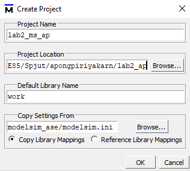  
**Изображение 10. Создание проекта в ModelSlim**
- Нажмите **Add Existing File** (Добавить существующий файл), чтобы добавить файлы fulladder.sv и testbench.sv.  Этот шаг может занять несколько секунд. Выберите **Compile → Compile All**.  Вы должны увидеть сообщение "2 compiles, 0 failed without errors".  Если у вас возникли ошибки, нажмите на красное сообщение о них, чтобы вывести их на экран. Исправьте плохой файл, затем скомпилируйте снова.

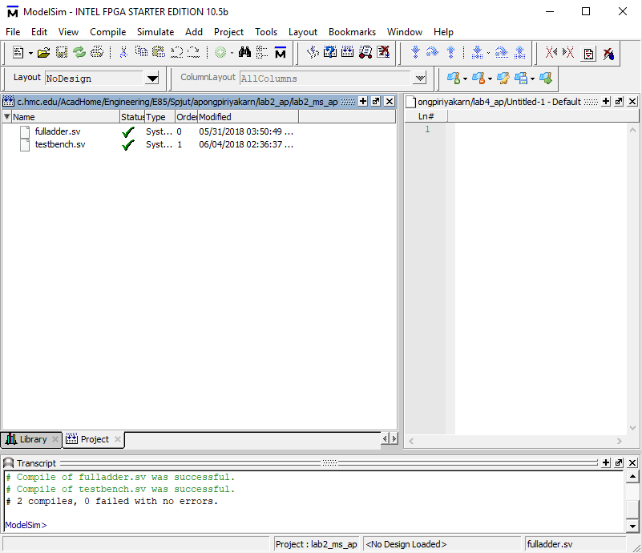  
**Изображение 11. Компиляция файлов**
- Выберите **Simulate → Start Simulation**... Нажмите символ + рядом с рабочей библиотекой, затем щелкните на ваш модуль testbench. Нажмите OK, чтобы просимулировать его.

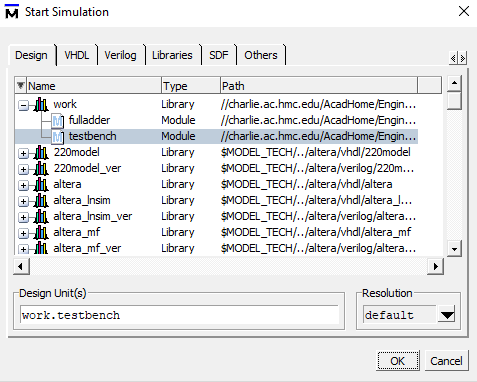  
**Изображение 12. Симуляция тестового стенда**
- На панели Objects выделите все сигналы, затем выберите **Add → To Wave → Selected Signals**, чтобы все входы и выходы отобразились в средстве просмотра осциллограмм.

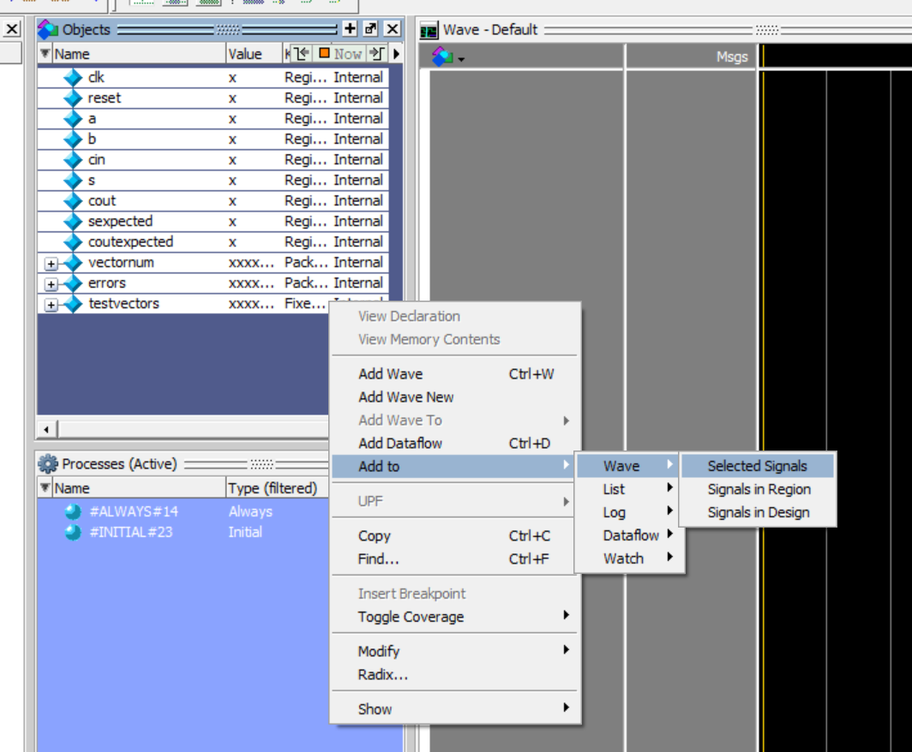  
**Изображение 13. Добавление сигналов к wave**

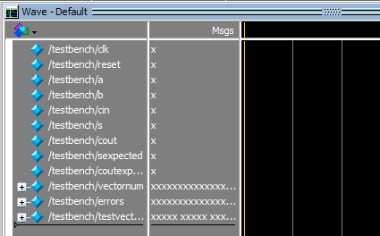  
**Изображение 14. Просмотр Wave окна** 
- Введите **run 200** в панели Transcript, чтобы запустить симуляцию на 200 единиц времени. Вы должны увидеть сообщение "8 тестов завершены с 0 ошибками".  Вы можете заставить осциллограммы снова появиться, используя вкладку **Wave** в нижней части бокового окна. Нажмите на значок **Zoom Full (F)**, чтобы увидеть полную развертку.

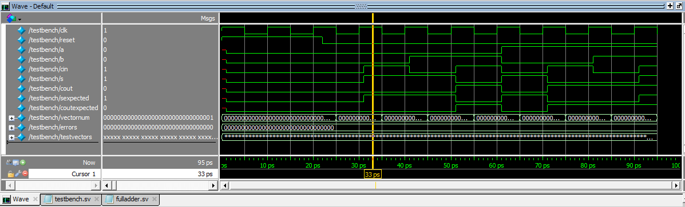  
**Изображение 15. Симуляция осциллограммы (waveform)**
    
	- Если вы видите предупреждение, что ModelSim не может найти ваш файл fulladder.tv, переместите его в тот же каталог, который вы выбрали для проекта ModelSim (lab2_ms_xx). Затем пропишите **restart -f** в панели Transcript для перезапуска симуляции, а затем пропишите **run 200** для повторного запуска. **restart -f** заставляет перезапустить моделирование без перекомпиляции. Это полезно, если вы хотите изменить тестовые векторы без изменения кода симуляции или тестбенча. Старые осцилограмы при этом перепишуться. Все начинается заново с 0. Это позволяет сохранить СПИСОК отображаемых сигналов в окне осциллограмм. Если вы измените что-либо, кроме тестовых векторов, вам нужно будет перекомпилировать и пройти через другие шаги.
    - Если вам когда-нибудь будет нужно остановить запущенную симуляцию, вы можете воспользоваться **Simulate → Break**.
    - Если вы внесли изменения в свой код, не забудьте выбрать Compile All снова перед повторным запуском, иначе вы повторно начнете симулировать старый код.

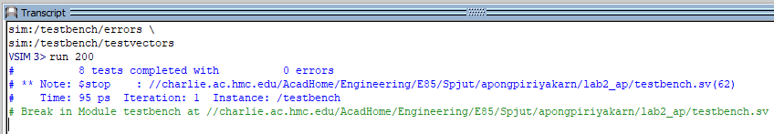  
**Изображение 16. Панель расшифровки показывает 0 ошибок**

Теперь давайте рассмотрим сигналы осциллограмм более подробно.

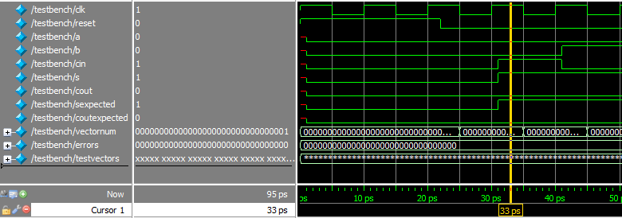  
**Изображение 17. Окно осциллограммы**

Первый столбец - это название каждого сигнала, за которым следует значение, на которое вы смотрите (желтая линия). В данном конкретном примере сигнал clk в первой строке на 33 ps имеет значение 1, так же как и **cin**, **s** и **sexpected**. 

Зеленые осциллограммы в третьем столбце показывают значения всех сигналов с течением времени ("ps" внизу). Обратите внимание, что сигнал **clk** начинается на высоком уровне в течение 5 ps, затем падает на низкий уровень в течение 5 ps и так далее, как мы закодировали в модуле testbench. Это означает, что один тактовый цикл длится 5+5=10 ps. Напомним, что мы подаем импульс сброса в течение 22 единиц времени (ps), что составляет 2,2 такта.

После подачи импульса сброса первый testvector(000_00) проходит, затем значение векторного числа начинает отсчет от 0 до 1 по отрицательному фронту тактового сигнала (25ps). При следующем нарастающем фронте тактового импульса(30ps) мы ждем 1 единицу времени перед загрузкой следующего testvector(001_01) на входы(a, b, cin) и ожидаемые выходы(coutexpected, sexpected). На следующем спадающем тактовом фронте (35ps) мы сравниваем выходы ИУ (cout, s) с нашими ожиданиями. Мы видим, что **s = sexpected = 1** и **cout = coutexpected = 0**, тогда векторный отсчет идет от 1 до 2. Этот процесс продолжается до тех пор, пока мы не достигнем последнего тестового вектора, после чего моделирование останавливается. Обратите внимание, что если произошла ошибка, сигнал станет красным. 

## 1.4 Программирование аппаратного обеспечения

Синтез создает битовый файл, указывающий, как должен быть сконфигурирован каждый логический блок и матрица соединений на ПЛИС. Если у вас под рукой оказалась плата DE0-CV, вы можете ее запрограммировать (прошить) с помощью битового файла для размещения вашей разработки на чипе. 

Теперь вернемся к Quartus Prime. 

- Выберете **Tools → Programmer**. 
    - Если в окне программатора рядом с **Hardware Setup** не написано **USB-Blaster**, то используйте кнопку **Hardware Setup**, чтобы установить значение **USB-Blaster**.
    - Если иконка **5CEBA4F23** на изображении выше не видна, нажмите **Add file...** и перейдите в папку "output_files" вашего проекта. Выберите файл .SOF. Он может быть предварительно выбран. 
- Нажмите на кнопку **Start**. Он должен запрограммировать ПЛИС и выполнить работу до 100%.

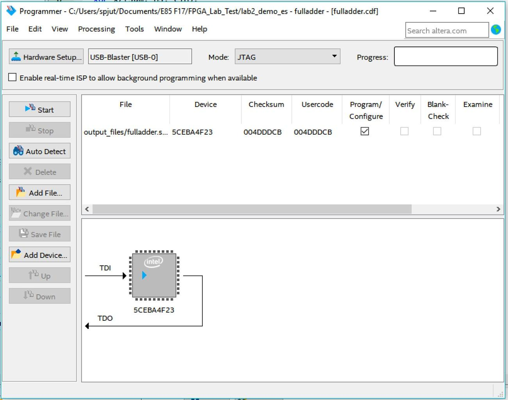  
**Изображение 18. Программирование ПЛИС на плате DE0-CV**

Теперь вы можете переместить тумблеры **SW[2:0]** на плате DE0-CV и посмотреть на красные светодиоды прямо над переключателями. Проверьте, что ваш сумматор складывает правильно.

## 2. DE0-CV Плата
Плата Altera / Intel DE0-CV содержит ПЛИС Altera Cyclone V 5CEBA4F23, источник питания, интерфейс USB для загрузки конфигурации с главного компьютера, а также некоторые светодиоды, переключатели и контакты расширения.

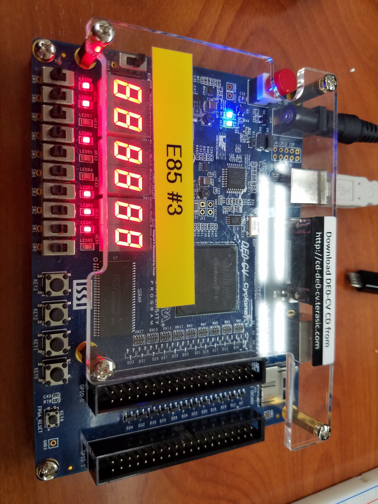  
**Изображение 19. DE0-CV Плата**

Если вы хотите узнать, что происходит *под капотом*, просмотрите [руководство пользователя DE0-CV](https://www.terasic.com.tw/cgi-bin/page/archive.pl?Language=English&CategoryNo=163&No=921&PartNo=4) на сайте класса. Панель управления **DE0CV_ControlPanel** на лабораторных компьютерах позволит вам поиграть со многими функциями.

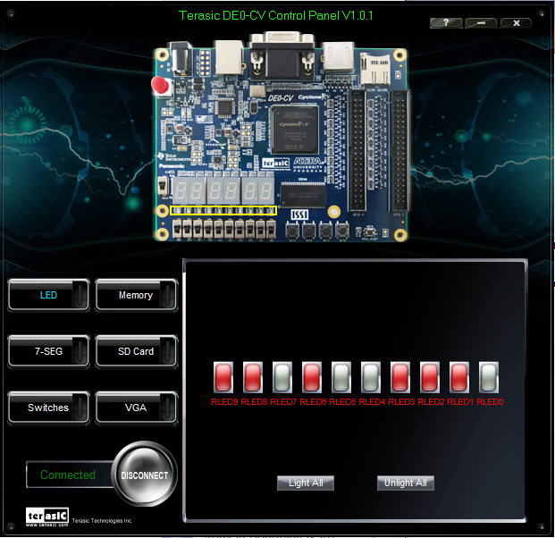  
**Изображение 20. DE0-CV_ControlPanel**
