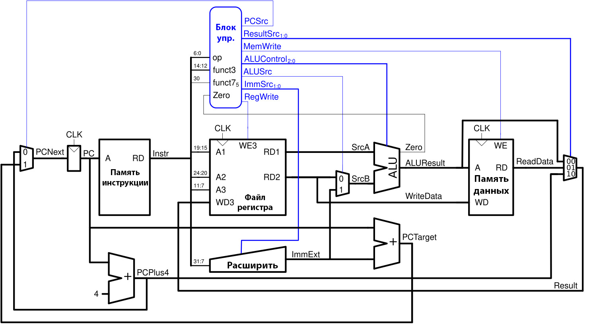
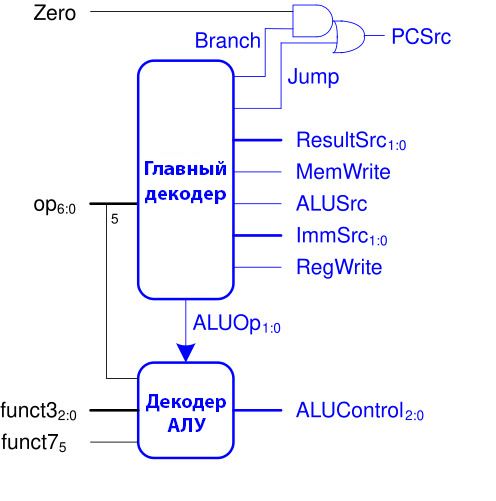
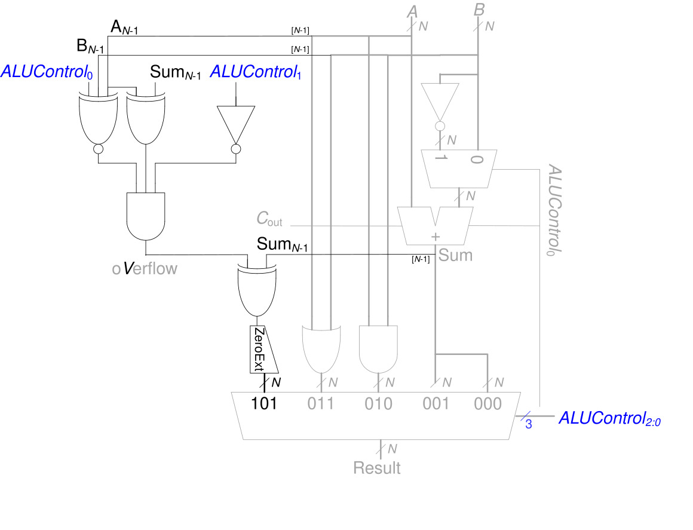
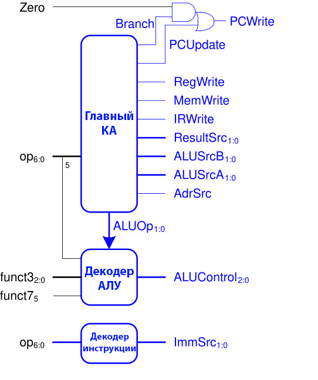
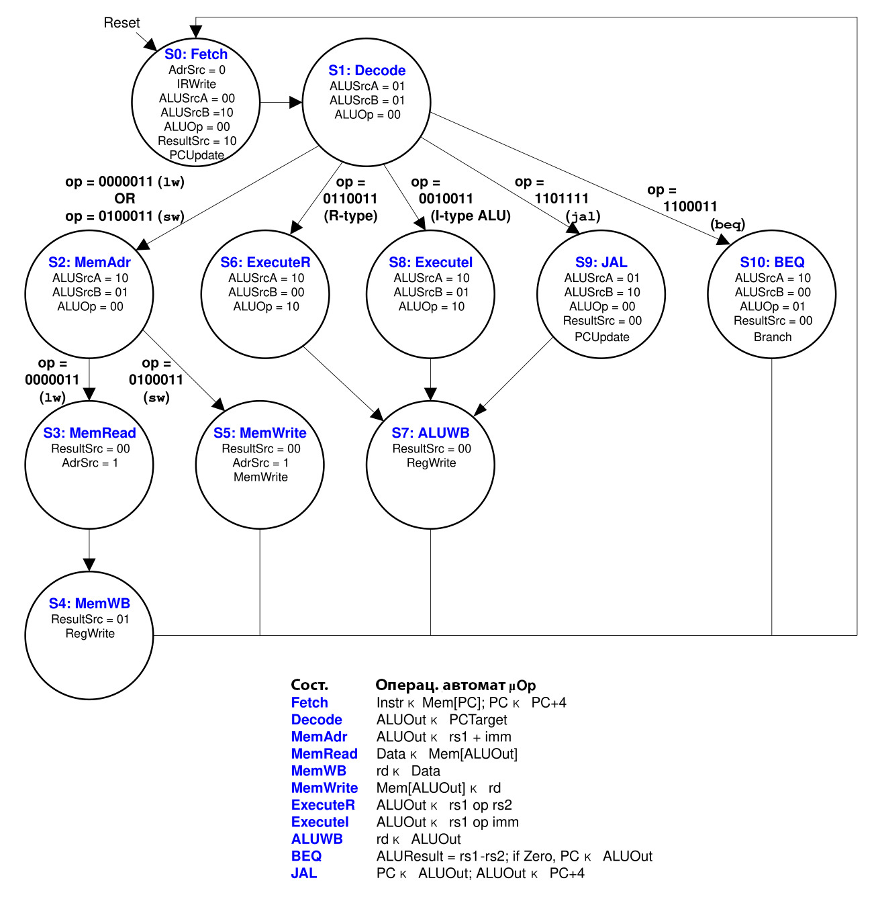
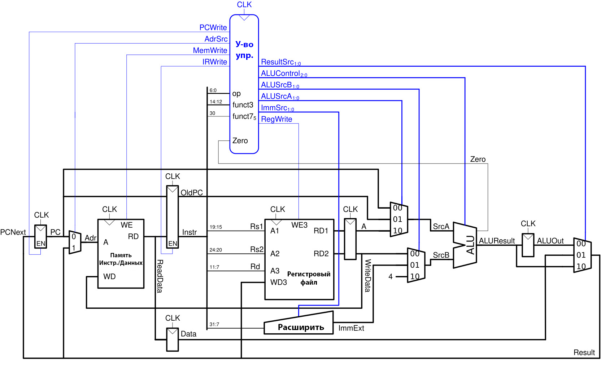
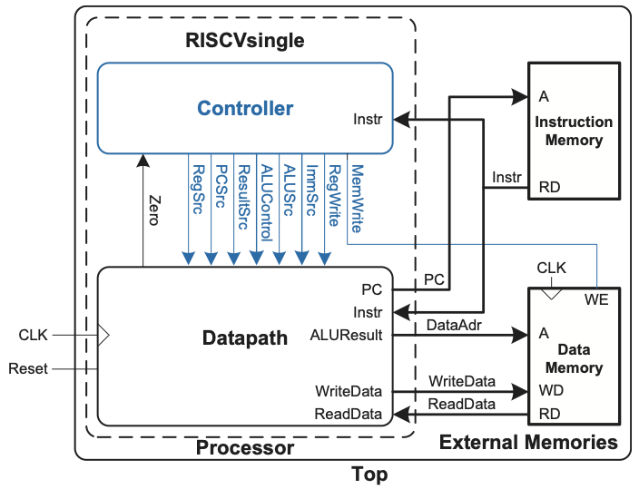

# Лабораторная работа №4: Однотактный процессор


## Цель работы
Лабораторная работа разделена на три части.
В первой части этой лабораторной работы, вы расширите однотактный процессор RISC-V для поддержки дополнительных инструкций в зависимости от варианта.
Во второй и третьей частях вы будете проектировать многотактный процессор RISC-V на SystemVerilog и протестируете его на простой программе, написанной на машинном языке. Это свяжет воедино всё, что вы узнали из курса о цифровом проектировании, языках описания аппаратуры, языке ассемблера и микроархитектуре, а также даст вам возможность спроектировать и отладить сложную систему. В части 2 вы соберете и протестируете контроллер. В части 3 вы соберете тракт данных и протестируете всю систему.

## Варианты
В каждом варианте надо поддержать одну инструкцию и проверить ее работу не сломав поддержку остальных инструкций
1.  `lb`
2.  `lbu`
3.  `bne`
4.  `blt`
5.  `bge`
6.  `bltu`
7.  `bgeu`
8.  `jalr`
9.  `sb`
10. `lui`
11. `xor`
12. `sra/srai`
13. `sll/slli`
14. `sltu`
15. `srl/srli`
16. `auipc`


## Часть 1. Однотактный процессор RISC-V
В файле `src/riscvtest.txt` находится код процессора, который вам предстоит изменить.
На [изобр. 1.1](#изобр-1-однотактный-процессор-risc-v) показан полный однотактный процессор из книги. На [изобр. 1.2](#изобр-2-устройство-управления-однотактным-процессором-risc-v) показано устройство управления, а на [изобр. 1.3](#изобр-3-арифметико-логическое-устройство) показано АЛУ (Арифметико-логическое устройство). На [таблицах 1.1 и 1.2](#таблица-1-таблица-истинности-главного-декодера) показаны таблицы истинности главного декодера и декодера АЛУ. На [таблице 1.3](#таблица-3-кодирование-immsrc) показано кодирование ImmSrc. На [изобр. 1.4](#изобр-4-тестовая-программа-risc-v) показана тестовая программа для однотактного процессора RISC-V из книги.

### Что нужно сдать:
2. Размеченная версия изображения 1 (однотактный процессор), показывающая нужные модификации (инструкция вашего варианта);
3. Размеченная версия изображений 2 и 3 (если отредактировано), показывающие нужные модификации для дополнительных инструкций (инструкция вашего варианта);
4. Измененные таблицы истинности главного декодера, декодера АЛУ и ImmSrc для поддержки инструкции вашего варианта;
5. Измененный код SystemVerilog, который добавляет поддержку инструкции вашего варианта;
6. Измененная тестовая программа, которая использует инструкцию вашего варианта. Вам надо будет написать тест аналогичный `src/riscvtest.s` и с помощью симулятора `Venus` собрать бинарный файл по аналогии с `src/riscvtest.txt`. Для этого удобно использовать `Column selection mode` в VSCode или аналогичный режим редактирования в других редакторах;
7. Осциллограммы симуляции (в перечисленном выше порядке: clk, reset, PC, Instr, SrcA, SrcB, ALUResult, DataAdr, WriteData и MemWrite - все должны быть в шестнадцатеричном формате для удобства чтения). Проходит ли ваша система тестбенч? Обведите или выделите волны, показывающие, что правильное значение записано по правильному адресу, и убедитесь, что они разборчивы.

Пожалуйста, укажите любые ошибки, которые вы нашли в этом руководстве или любые предложения по улучшению лабораторной работы.

### Приложения

#### Изобр. 1.1: Однотактный процессор RISC-V


#### Изобр. 1.2: Устройство управления однотактным процессором RISC-V


#### Изобр. 1.3: Арифметико-логическое устройство


#### Таблица 1.1. Таблица истинности главного декодера
|   Инструкция  |  Опкод  | RegWrite | ImmSrc | ALUSrcA | ALUSrcB | MemWrite | ResultSrc | Branch| ALUOp |  Jump   |
|:-------------:|:-------:|:--------:|:------:|:-------:|:-------:|:--------:|:---------:|:-----:|:-----:|:-------:|
| lw            | 0000011 | 1        | 00     | 0       | 1       | 0        | 01        | 0     | 00    | 0       |
| sw            | 0100011 | 0        | 01     | 0       | 1       | 1        | xx        | 0     | 00    | 0       |
| R-type        | 0110011 | 1        | xx     | 0       | 0       | 0        | 00        | 0     | 10    | 0       |
| beq           | 1100011 | 0        | 10     | 0       | 0       | 0        | xx        | 1     | 01    | 0       |
| I-type ALU    | 0010011 | 1        | 00     | 0       | 0       | 0        | 00        | 0     | 10    | 0       |
| jal           | 1101111 | 1        | 11     | x       | x       | 0        | 10        | 0     | xx    | 1       |

#### Таблица 1.2. Таблица истинности декодера АЛУ
|     ALUOp1:0    |     funct32:0    |     {op5, funct75}      |     ALUControl2:0    |     Операция     |
|:---------------:|:----------------:|:-----------------------:|:--------------------:|:----------------:|
|     00          |     x            |     x                   |     000              |     Add          |
|     01          |     x            |     x                   |     001              |     Subtract     |
|     10          |     000          |     00, 01, 10          |     000              |     Add          |
|                 |     000          |     11                  |     001              |     Subtract     |
|                 |     010          |     x                   |     101              |     SLT          |
|                 |     110          |     x                   |     011              |     OR           |
|                 |     111          |     x                   |     010              |     AND          |

#### Таблица 1.3. Кодирование ImmSrc
|     ImmSrc    |                                   ImmExt                                  |    Тип   |             Описание            |
|:-------------:|:-------------------------------------------------------------------------:|:--------:|:-------------------------------:|
|     00        | {{20{Instr[31]}}, Instr[31:20]}                                           |     I    | 12-битовая знаковая мгновенная  |
|     01        |     {{20{Instr[31]}}, Instr[31:25], Instr[11:7]}                          |     S    | 12-битовая знаковая мгновенная  |
|     10        |     {{20{Instr[31]}}, Instr[7], Instr[30:25],   Instr[11:8], 1’b0}        |     B    | 13-битовая знаковая мгновенная  |
|     11        |     {{12{Instr[31]}}, Instr[19:12], Instr[20],   Instr[30:21], 1’b0}      |     J    | 21-битовая знаковая мгновенная  |

#### Изобр. 1.4: Тестовая программа RISC-V
```
#       RISC-V Assembly         Description               Address   Machine
main:   addi x2, x0, 5          # x2 = 5                  0         00500113   
        addi x3, x0, 12         # x3 = 12                 4         00C00193
        addi x7, x3, -9         # x7 = (12 - 9) = 3       8         FF718393
        or   x4, x7, x2         # x4 = (3 OR 5) = 7       C         0023E233
        and  x5, x3, x4         # x5 = (12 AND 7) = 4     10        0041F2B3
        add  x5, x5, x4         # x5 = (4 + 7) = 11       14        004282B3
        beq  x5, x7, end        # shouldn't be taken      18        02728863
        slt  x4, x3, x4         # x4 = (12 < 7) = 0       1C        0041A233
        beq  x4, x0, around     # should be taken         20        00020463
        addi x5, x0, 0          # shouldn't happen        24        00000293
around: slt  x4, x7, x2         # x4 = (3 < 5)  = 1       28        0023A233
        add  x7, x4, x5         # x7 = (1 + 11) = 12      2C        005203B3
        sub  x7, x7, x2         # x7 = (12 - 5) = 7       30        402383B3
        sw   x7, 84(x3)         # [96] = 7                34        0471AA23 
        lw   x2, 96(x0)         # x2 = [96] = 7           38        06002103 
        add  x9, x2, x5         # x9 = (7 + 11) = 18      3C        005104B3
        jal  x3, end            # jump to end, x3 = 0x44  40        008001EF
        addi x2, x0, 1          # shouldn't happen        44        00100113
end:    add  x2, x2, x9         # x2 = (7 + 18)  = 25     48        00910133
        sw   x2, 0x20(x3)       # mem[100] = 25           4C        0221A023 
done:   beq  x2, x2, done       # infinite loop           50        00210063
```

## Часть 2. Многотактный контроллер RISC-V
Перед началом разработки контроллера, взгляните на следующие диаграммы. Все изображения и таблицы находятся в конце данной страницы.

- На [изобр. 2.1](#изобр-1-диаграмма-устройства-управления-многотактным-контроллером) показана диаграмма блока управления многотактным контроллером
- На [изобр. 2.2](#изобр-2-диаграмма-многотактного-управления-главного-конечного-автомата) показана диаграмма многотактного управления главного конечного автомата
- [Таблица 2.1](#таблица-1-логика-декодера-алу) и [пример языка ОА 1](#пример-языка-оа-1-декодер-алу) (описания аппаратуры) определяют логику декодера АЛУ. 
- [Таблица 2.2](#таблица-2-логика-декодера-инструкций-для-immsrc) и [пример языка ОА 2](#пример-языка-оа-2-декодер-инструкций) определяют логику декодера инструкций.

Напишите иерархическое описание многотактного контроллера на SystemVerilog. Когда вам не важны выводы, вы можете установить их в 0, чтобы они имели детерминированное значение для простоты тестирования.

Контроллер должен иметь следующее объявление модуля и следовать иерархии [изобр. 2.1](#изобр-1-диаграмма-устройства-управления-многотактным-контроллером). Помните, что `op`, `funct3`, `funct7b5` являются битовыми полями инструкции, а `zero` - это вывод АЛУ. 

---
```verilog
module controller(input   logic       clk,
                  input   logic       reset,  
                  input   logic [6:0] op,
                  input   logic [2:0] funct3,
                  input   logic       funct7b5,
                  input   logic       zero,
                  output  logic [1:0] immsrc,
                  output  logic [1:0] alusrca, alusrcb,
                  output  logic [1:0] resultsrc, 
                  output  logic       adrsrc,
                  output  logic [2:0] alucontrol,
                  output  logic       irwrite, pcwrite, 
                  output  logic       regwrite, memwrite);
```
---

### 2.2. Тестбенч. 
Генерирование хороших тестовых векторов часто сложнее, чем написание кода, который вы тестируете. В этом семестре векторы вам предоставляются, чтобы облегчить вашу работу. Найдите файлы `controller_testbench.sv` и `controller.tv`, прочитайте их и поймите, что они делают. 

Скомпилируйте и протестируйте ваш контроллер при помощи Modelsim. Убедитесь, что тест выполняется достаточно долго для того, чтобы получить сообщение о том, что тест был заверешен без ошибок.

### 2.3. Подсказки по отладке
Если только вам необычайно не повезет, ваш контроллер не заработает идеально с первой попытки. Если бы это произошло, вы бы упустили основной элемент обучения в этой лабораторной работе - как систематически отлаживать сложную систему. Контроллер понадобится вам в следующей части, поэтому уделите время полной отладке. 

Вот несколько советов, которые помогут сократить время, затрачиваемое на отладку.

#### *Минимизируйте количество ошибок, которые у вас есть*
Каждая ошибка требует довольно много времени, чтобы её обнаружить, поэтому немного дополнительного времени на этапе проектирования может сэкономить вам много времени на этапе отладки.

- Помните, что вы создаете аппаратуру, поэтому сделайте наброски аппаратуры, которая вам нужна, и напишите идиомы SystemVerilog, которые как-либо подразумевают эту аппаратуру. Не пишите код SystemVerilog, не думая об аппаратуре, которую он подразумевает.
- Вычитайте свой код. Убедитесь, что имена сигналов написаны последовательно, а входы/выходы модулей перечислены в правильном порядке. 
- Синтезируйте свой проект один раз в Quartus и обратите внимание на предупреждения или ошибки. Убедитесь, что вы понимаете, какие предупреждения являются нормальными (например, не заданы временные ограничения), а какие необходимо исправить. Отнеситесь к этим предупреждениям очень серьезно; это самый быстрый способ обнаружить тонкие ошибки в вашем проекте.
- Смоделируйте свой проект в Modelsim и посмотрите, появятся ли предупреждения при компиляции. Modelsim имеет другой анализатор SystemVerilog и обнаружит те типы ошибок, которые не вызывают предупреждений в Quartus. Отнеситесь серьезно и к этим предупреждениям.

#### *Минимизируйте время, затрачиваемое на проведене тестирования*
Когда вы находитесь на этапе отладки, выберите эффективный рабочий процесс, чтобы вы могли внести изменения в код и повторно запустить тест в течение нескольких секунд, а не минут.

- Все тестирование может быть выполнено в Modelsim. Вам не нужно использовать Quartus, а перекомпиляция в Quartus - это ненужный шаг, отнимающий время. Однако, если вы внесли значительные изменения, вы можете захотеть время от времени повторно синтезировать проект в Quartus и поискать предупреждения, говорящие о том, что вы внесли новые ошибки.
- Добавьте соответствующие осциллограммы в Modelsim. Обычно стоит добавить все сигналы модуля, который вы отлаживаете, чтобы не проходить через утомительный процесс добавления новых сигналов и повторного моделирования. Измените формат отображения 32-битных сигналов в шестнадцатеричный.
- Помните, что вам не нужно перезапускать Modelsim и заново добавлять сигналы каждый раз, когда вы изменяете свой код. Вместо этого:
    - Compile -> Compile All
    - Убедитесь, что у вас нет никаких предупреждений
    - В коммандной строке перезапустите симуляцию, прописав:
        - `restart -f`
        - `run 1000` (измените число в зависимости от желаемого времени симуляции)

#### *Находите ошибки систематически*
Неопытные разработчики могут потратить огромное количество времени на отладку, не меня в голово четкого плана. Следующие приемы помогут сэкономить вам кучу времени.

- Поймите, какими должны быть ожидаемые вводы и выводы. Запишите свои ожидания. Это требует времени, но обычно экономит гораздо больше времени, чем отнимает.
- Найдите первое место, где сигнал не соответствует вашим ожиданиям. Один плохой сигнал обычно вызывает другие, поэтому сосредоточьте отладку на первой известной ошибке и пока не беспокойтесь о последующих ошибках. Например, если тесты 1 и 5 выдают ошибки, то начните отладку теста 1, а не теста 5.
- Убедитесь, что симулятор отображает все сигналы, участвующие в вычислении плохого сигнала. Если необходимо, добавьте их в симулятор и повторите симуляцию, как указано выше. Если один из этих вводов является плохим, повторите этот процесс, чтобы продолжить его трассировку. 
- Если все вводы хорошие, а вывод плохой, вы обнаружили ошибку. Изучите соответствующий модуль SystemVerilog и исправьте ошибку.
- Повторяйте все эти процессы до тех пор, пока все ошибки не будут устранены.

### Что нужно сдать
1. Иерархический SystemVerilog для вашего модуля контроллера, соответствующий объявлению, приведенному выше.
2. Проходит ли контроллер ваши тестовые векторы?

Пожалуйста, укажите любые ошибки, которые вы нашли в этом руководстве или любые предложения по улучшению лабораторной работы.

### Приложения

#### Изобр. 2.1: Диаграмма устройства управления многотактным контроллером


#### Изобр. 2.2: Диаграмма многотактного управления главного конечного автомата


#### Таблица 2.1. Логика декодера АЛУ
|     ALUOp    |     funct3    |     op(5),   funct7(5)    |     Инструкция     |         ALUControl(2:0)        |
|:------------:|:-------------:|:---------------------:|:------------------:|:----------------------------:|
|       00     |        X      |            X          |        lw, sw      |     000 (add)                |
|       01     |        X      |            X          |         beq        |     001 (subtract)           |
|       10     |       000     |       00, 01, 10      |         add        |     000 (add)                |
|              |       000     |           11          |         sub        |     001 (subtract)           |
|              |       010     |            X          |         slt        |     101 (set   less than)    |
|              |       110     |            X          |          or        |     011 (or)                 |
|              |       111     |            X          |         and        |     010 (and)                |

#### Пример языка ОА 1. Декодер АЛУ
```verilog
module aludec(input  logic       opb5,
              input  logic [2:0] funct3,
              input  logic       funct7b5, 
              input  logic [1:0] ALUOp,
              output logic [2:0] ALUControl);

  logic  RtypeSub;
  assign RtypeSub = funct7b5 & opb5;  // TRUE for R-type subtract instruction

  always_comb
    case(ALUOp)
      2'b00:                ALUControl = 3'b000; // addition
      2'b01:                ALUControl = 3'b001; // subtraction
      default: case(funct3) // R-type or I-type ALU
                 3'b000:  if (RtypeSub) 
                            ALUControl = 3'b001; // sub
                          else          
                            ALUControl = 3'b000; // add, addi
                 3'b010:    ALUControl = 3'b101; // slt, slti
                 3'b110:    ALUControl = 3'b011; // or, ori
                 3'b111:    ALUControl = 3'b010; // and, andi
                 default:   ALUControl = 3'bxxx; // ???
               endcase
    endcase
endmodule
```

#### Таблица 2.2. Логика декодера инструкций для *ImmSrc*
|     Инструкция     |     Опкод (*op*)   |     *ImmSrc*(1:0)    |
|:------------------:|:------------------:|:----------------:|
|        R-type      |       0110011      |         XX       |
|        I-type      |       0010011      |         00       |
|          lw        |       0000011      |         00       |
|          sw        |       0100011      |         01       |
|         beq        |       1100011      |         10       |
|         jal        |       1101111      |         11       |

#### Пример языка ОА 2. Декодер инструкций
```verilog
module instrdec (input  logic [6:0] op, 
                 output logic [1:0] ImmSrc);
  always_comb
    case(op)
      7'b0110011: ImmSrc = 2'bxx; // R-type
      7'b0010011: ImmSrc = 2'b00; // I-type ALU
      7'b0000011: ImmSrc = 2'b00; // lw
      7'b0100011: ImmSrc = 2'b01; // sw
      7'b1100011: ImmSrc = 2'b10; // beq
      7'b1101111: ImmSrc = 2'b11; // jal
      default:         ImmSrc = 2'bxx; // ???
    endcase
endmodule
```

## Часть 3. Многотактный процессор RISC-V
На [изобр. 3.1](#изобр-1-полный-многотактный-процессор) показан полный многотактный процессор.

На [изобр. 3.2](#изобр-2-многотактный-процессор-сопряженный-с-внешней-памятью) (в конце лабораторной работы) показана иерархия высокого уровня однотактного процессора, включая связи между контроллером, трактом данных, памятью инструкций и памятью данных. Ваш многотактный процессор имеет только одну унифицированную память и немного другие сигналы управления, поэтому вам нужно будет изменить эти соединения. Нарисуйте схему, подобную изобр. 2, на которой показаны контроллер, тракт данных и модули памяти. Нарисуйте блок для модуля  `riscv`, который должен охватывать контроллер и тракт данных. Пометьте сигналы, проходящие между блоками.

Напишите иерархическое описание процессора на SystemVerilog. Объявления некоторых модулей можете найти в `riscvmulti.sv`. Сигналы памяти топ-модуля выведены в целях тестирования. Используйте ваш контроллер из лабораторной работы 10 и любые общие строительные блоки Verilog, которые вам нужны (например, mux'ы, flop'ы, сумматоры, АЛУ, регистровый файл, немедленный расширитель и т.д.) из однотактного процессора. 

---
```verilog
module top(input  logic        clk, reset, 
           output logic [31:0] WriteData, DataAdr, 
           output logic        MemWrite);
```
---

Просмотрите `riscv_testbench.sv` и тестовый код (на ассемлере `.s` и машинном языке `.txt`). Изучите тестбенч, чтобы понять как он определяет, завершились ли ваши тесты с успехом или провалом.

Прежде чем начать симуляцию, предскажите, что должен делать процессор во время выполнения первых трех инструкций. [Таблица 3.1](#таблица-1-ожидаемая-операция-после-двух-тактов-сброса) уже заполнена для первой инструкции.

Сгенерируйте осциллограммы симуляции, по крайней мере, для сигналов clk, reset, PC, Instr, state, SrcA, SrcB, ALUResult, Adr, WriteData и MemWrite. Отобразите 32-битные сигналы в шестнадцатеричном формате для удобства чтения (выберите сигналы и щелкните правой кнопкой мыши, затем выберите Radix). Сравните с вашими ожиданиями. Возможно, вы захотите добавить другие сигналы для облегчения отладки. Исправляйте любые проблемы, которые вы найдете, пока ваш код не выполнит программу, как ожидалось, и тестбенч не сообщит об успехе.

Обратитесь к предыдущей лабораторной для просмотра подсказок по отладке. Перед дальнейшей отладкой исправьте все соответствующие предупреждения Quartus и Modelsim. Это сэкономит вам много времени, если вы тщательно предскажете, что каждый из сигналов в ваших осциллограммах должен делать в каждом такте. А также будете систематически отлаживать, начиная с первого известного несоответствия и работая в обратном направлении, пока не получите хорошие вврды и плохие выводы и не изолируете ошибку.

К особенно распространенным ошибкам относятся:

- Копирование кода однотактного процессора с сигналами, не соответствующими многотактному процессору. Убедитесь, что у вас есть четкое представление о том, что должно быть в каждом модуле. Вы, вероятно, сэкономите время, если набросаете рисунок, подобный изобр. 3.2, и определите, какие сигналы проходят между riscv и модулями памяти.
- Подключение сигналов в разном порядке в объявлении модуля и в инстанцировании.
- Не объявление внутренних сигналов или задание им неправильной ширины.
- Ошибки в написании имен объектов.

Если вы проверили всё вышеуказанное, а процессор все еще не работает, попробуйте добавить все выводы контроллера в вашу осцилограмму и убедитесь, что ни один из них не является плавающим или X. Если вы все еще не нашли проблему, обратитесь к предсказанным осциллограммам в таблице 3.1 и проверьте, что процессор делает правильные действия на каждом шаге. Если первые несколько инструкций верны, вам может понадобиться расширить таблицу, чтобы предсказать, что должна делать остальная часть программы. (Когда вы заполните таблицу для нескольких инструкций, вы, возможно, поймете суть схемы и будете заполнять только те записи, которые вам интересны.)

### Что нужно сдать
1. Диаграмма, показывающая вашу память, riscv, операционный автомат, иерархию блока контроллера и названия всех сигналов между ними
2. Иерархический SystemVerilog для вашего процессорного модуля верхнего уровня (и подмодулей), соответствующего декларации, приведенной выше.
3. Таблица 3.1, показывающая ключевые сигналы, по крайней мере, для первых трех инструкций.
4. Осциллограммы симуляции (в перечисленном выше порядке: clk, reset, PC, Instr, SrcA, SrcB, ALUResult, DataAdr, WriteData и MemWrite - все должны быть в шестнадцатеричном формате для удобства чтения). Проходит ли ваша система тестбенч? Обведите или выделите волны, показывающие, что правильное значение записано по правильному адресу, и убедитесь, что они разборчивы.

Пожалуйста, укажите любые ошибки, которые вы нашли в этом руководстве или любые предложения по улучшению лабораторной работы.

### Приложения

#### Изобр. 3.1: Полный многотактный процессор


#### Изобр. 3.2: Многотактный процессор сопряженный с внешней памятью


#### Таблица 3.1. Ожидаемая операция (после двух тактов сброса)
|     Шаг    |     PC    |     Инструкция    |        Состояние    |     Результат |         Прим. о результате        |
|:----------:|:---------:|:-----------------:|:-------------------:|:-------------:|:---------------------------------:|
|      3     |     00    |      00500113     |       S0: Fetch     |        4      |                PC+4               |
|      4     |     04    |         ""        |      S1: Decode     |        X      |           OldPC+Immediate         |
|      5     |     04    |         ""        |     S8: ExecuteI    |        X      |     ALUResult = x0 (0) + 5 = 5    |
|      6     |     04    |         ""        |       S7: ALUWB     |        5      |           Result = ALUOUT         |
|      7     |     04    |         ""        |       S0: Fetch     |        8      |                PC+4               |
|      8     |     08    |      00c00193     |      S1: Decode     |        X      |           OldPC+Immediate         |
|      9     |           |                   |                     |               |                                   |
|      10    |           |                   |                     |               |                                   |
|      11    |           |                   |                     |               |                                   |
|      12    |           |                   |                     |               |                                   |
|      13    |           |                   |                     |               |                                   |
|      14    |           |                   |                     |               |                                   |
|      15    |           |                   |                     |               |                                   |
|      16    |           |                   |                     |               |                                   |
|      17    |           |                   |                     |               |                                   |
|      18    |           |                   |                     |               |                                   |
|      19    |           |                   |                     |               |                                   |
|      20    |           |                   |                     |               |                                   |
|      21    |           |                   |                     |               |                                   |
|      22    |           |                   |                     |               |                                   |
|      23    |           |                   |                     |               |                                   |
|      24    |           |                   |                     |               |                                   |
|      25    |           |                   |                     |               |                                   |
|      26    |           |                   |                     |               |                                   |
|      27    |           |                   |                     |               |                                   |
|      28    |           |                   |                     |               |                                   |
|      29    |           |                   |                     |               |                                   |
|      30    |           |                   |                     |               |                                   |
|      31    |           |                   |                     |               |                                   |
|      32    |           |                   |                     |               |                                   |
|      33    |           |                   |                     |               |                                   |
|      34    |           |                   |                     |               |                                   |
|      35    |           |                   |                     |               |                                   |
|      36    |           |                   |                     |               |                                   |
|      37    |           |                   |                     |               |                                   |
|      38    |           |                   |                     |               |                                   |
|      39    |           |                   |                     |               |                                   |
|      40    |           |                   |                     |               |                                   |
|      41    |           |                   |                     |               |                                   |
|      42    |           |                   |                     |               |                                   |
|      43    |           |                   |                     |               |                                   |

(Заполняйте только колонку с заметками, поскольку это полезно для вас, чтобы понимать, что происходит и почему.)