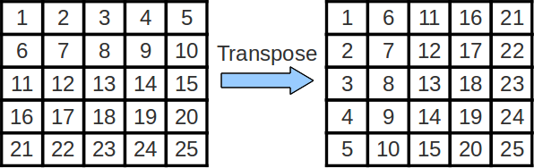
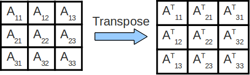

# Лабораторная работа №7: кеш

## Обзор - Политика кеширования

### Политика записи
кеш содержит подмножество данных, хранящихся в памяти. Когда мы выполняем операцию записи, нам нужно убедиться, что все, кто пытается получить доступ к данным, получат самую актуальную копию. Существует две различные политики обработки записи:

**Отложенная запись (write-back)**

- Запись проводится только в кеш, не в память.
- Чтобы показать, что данные в кеше более актуальны, чем данные в памяти, мы устанавливаем бит изменения этой строки кеша на 1. Когда эта строка будет исключены из кеша, бит изменения будет указывать на то, что строка должна быть записана в память.
- Данные в кеше будут более актуальными, чем данные в памяти в течение короткого периода времени. Это не проблема, потому что если мы захотим получить доступ к этим данным, мы будем искать их в кеше, перед тем, как искать их в памяти.
- Запись в кеш происходит намного быстрее, чем запись в память, что делает задержку записи в кешах с отложенной записью меньше, чем в кешах с сквозной записью.
- Политика отложенной записи также уменьшает количество записей в память. Как только мы заносим часть данных в кеш, мы можем записывать в него несколько раз, прежде чем исключить эту часть из кеша. С политикой отложенной записи нам приходится записывать в память только тогда, когда строка исключается, а не каждый раз, когда она обновляется.

**Сквозная запись (write-through)**

- Запись проводится одновременно и в кеш, и в память.
- Запись в кеш происходит быстро, а запись в основную память - медленно; это делает задержку записи в кешах со сквозной записью медленнее, чем в кешах с отложенной записью.
- кеш со сквозной записью проще в реализации, чем кеш c отложенной записью.

### Политика размещения

**Запись с размещением (write-allocate)**

- При записи-промахе, вы вставляете в кеш блок, по которому был получен промах.

**Запись без размещения (no write-allocate)**

- При записи-промахе, вы не вставляете пропущенный блок в кеш. Обновляется только память.
- При чтении-промахе, данные всё равно загружаются в кеш

### Частые комбинации
**Сквозная запись/запись без размещения**

- При записи-попадании, запись осуществляется как в кеш, так и в основную память.
- При записи-промахе, главная память обновляется и блок не попадает в кеш.
- При чтении-промахе блок попадает в кеш.
- Если чтение того же самого блока произойдет после записи-промаха, то произойдет лишний промах (почему так происходит?)
- Эта политика полезна, когда мы записываем данные, к которым не планируем обращаться снова.

**Отложенная запись/запись с ращмешением**

- При записи-попадании, обновляется только копия кеша, и поэтому устанавливается бит изменения.
- При записи-промахе соответствующий блок попадает в кеш, обновляется, а бит изменения устанавливается в 1.
- Если к одному и тому же блоку произойдет обращение, все последующие записи будут удалены, а бит изменения будет установлен до тех пор, пока блок не будет замещен, при этом, он будет перемещен обратно в основную память.

### Политика замещения

- **LRU** (Least recently used - Наименее часто используемый) - Когда мы решаем исключить блок кеша, чтобы освободить место, мы выбираем блок, который не использовался дольше всех по времени из блоков.
- **Random** (Случайный) - когда мы решаем исключить блок кеша, чтобы сохранить пространство, мы случайным образом выбираем один из блоков, который будет исключен.
- **MRU** (most recently used - самый недавно использованный) - Когда мы решаем исключить блок кеша, чтобы освободить место, мы выбираем блок, который использовался самым последним из всех блоков.

## Упражнение 1 - Симулятор кеша Venus
[Venus](https://venus.cs61c.org/) имитирует кеш со сквозной записью и записью с размещением (что не является общепринятой нормой). Мы будем использовать [Venus](https://venus.cs61c.org/) только для отслеживания шаблонов попаданий. кеши со сквозной и отложенной записью ведут себя примерно одинаково (оба записывают данные в кеш), поэтому модели попаданий/промахов, которые вы видите в симуляторе кеша Venus, были бы одинаковыми, даже если бы [Venus](https://venus.cs61c.org/) имитировал кеш с отложенной записью.

В этом упражнении будет использоваться инструмент визуализации кеша Venus для анализа производительности кода `cache.s`. Вы будете изменять параметры в коде, чтобы проанализировать, как они влияют на производительность кеша.

Для **каждого** из приведенных ниже сценариев вы будете повторять эти шаги:

1. В коде для `cache.s` установите соответствующие параметры программы, как указано в начале каждого сценария
2. Перейдите в Simulator-->Cache, чтобы установить соответствующие параметры кеша, как указано в начале каждого сценария.
3. По мере выполнения кода в Venus, любое обращение к памяти данных (загрузка или сохранение) будет отображаться (загрузка инструкций не отображается, поскольку инструкции загружаются в отдельный кеш инструкций, который не отображается в Venus).

Симулятор кеша покажет состояние вашего кеша данных. Если вы сбросите код, то сбросится и частота попаданий/промахов в кеш!

**ВАЖНО**: Если вы запустите весь код сразу, вы получите окончательное состояние кеша и количество попаданий. Полезной стратегией может быть установка **точки останова** в **цикле** `wordLoop` непосредственно перед или после каждого обращения к памяти, чтобы увидеть, откуда именно происходят попадания и промахи.

Ниже перечислены вопросы, которые стоит задать себе при анализе производительности кеша:

- Каков размер одного блока кеша?
- Сколько последовательных обращений (с учетом размера шага) помещается в один блок?
- Сколько данных помещается в ВЕСЬ кеш?
- Как далеко друг от друга в памяти находятся блоки, которые привязны на один и тот же набор (и может ли это создавать конфликты)?
- Какова ассоциативность вашего кеша?
- Где в кеше находится определенный конкретный блок?
- При рассмотрении вопроса о том, почему какое-либо конкретное обращение оказалось неудачным или удачным: Обращались ли вы к этому фрагменту данных раньше? Если да, то он все еще находится в кеше или нет?

### Ход работы
Прочитайте `cache.s`, чтобы понять, что делает программа. Смоделируйте в Venus следующие 3 сценария и ответьте на соответствующие вопросы.

**Сдача**: Ответьте на вопросы по каждому сценарию в Google-форме, ссылка на которую приведена выше.

### Сценарий 1
**Параметры программы**: (установите их, инициализировав регистры "a" в коде)

- **Размер массива** (`a0`): 128 (байт)
- **Размер шага** (`a1`): 8
- **Количество повторений** (`a2`): 4
- **Вариант** (`a3`): 0

**Параметры кеша**: (установите их на вкладке Cache)

- **Уровни кеша**: 1
- **Размер блока**: 8
- **Количество блоков**: 4
- **Включить?**: Должно быть отмечено зеленым
- **Политика размещения**: Прямое отображение
- **Ассоциативность**: 1 (Venus не позволяет вам изменить этот параметр с политикой размещения прямого отображения, почему?)
- **Политика замены блоков**: LRU

**Совет**: Если вам трудно представить, что именно попадает в кеш при каждом обращении к памяти, просто глядя на код, попробуйте достать бумагу и карандаш. Запишите разбивку 32-битных адресов на tag:index:offset (TIO), выясните, какие адреса памяти соответствуют какому набору в кеше с помощью индексных битов, и посмотрите, поможет ли это вам.

#### Вопросы 
1. Какая комбинация параметров обеспечивает наблюдаемую вами частоту попаданий? Запишите свой ответ в виде «[параметр A], [параметр B]», где два параметра завершают следующий ответ: «Благодаря тому, что [параметр A] в байтах точно равен [параметру B] в байтах». Примечание. Не забывайте, что «размер кеша» — это допустимый параметр, который вы неявно задаете, выбирая размер блока и количество блоков.
2. Какова будет наша частота попаданий, если мы произвольно увеличим количество повторений? Запишите свой ответ в виде десятичной дроби (например, «1,0», если HR равен 100%).
3. Как мы можем изменить один параметр программы, чтобы получить максимально возможную частоту попаданий? Запишите ответ в виде «[параметр], [значение]», где [параметр] — это параметр программы, который вы хотите изменить, а [значение] — это значение, на которое вы хотите его изменить. Примечание. Неважно, обращаемся ли мы к одним и тем же элементам массива. Просто дайте нам модификацию параметра программы, которая увеличит количество попаданий. Однако убедитесь, что предложенное вами значение верное.

### Сценарий 2
**Параметры программы**: (установите их, инициализировав регистры "a" в коде)

- **Размер массива** (`a0`): 256 (байт)
- **Размер шага** (`a1`): 2
- **Количество повторений** (`a2`): 1
- **Вариант** (`a3`): 1

**Параметры кеша**: (задайте их на вкладке Cache)

- **Уровни кеша**: 1
- **Размер блока**: 16
- **Количество блоков**: 16
- **Включить?**: Должен быть зеленым
- **Политика размещения**: Ассоциативный кеш с N-образным набором
- **Ассоциативность**: 2
- **Политика замены блоков**: LRU

#### Вопросы
1. Сколько обращений к памяти приходится на одну итерацию внутреннего цикла (не связанно с числом повторений)?
2. Какой повторяющийся шаблон попаданий/промахов? Запишите свой ответ в форме «MMHHMMH» (M -- miss, промах; H -- hit, попадание) и т. д., где ваш ответ представляет собой самый короткий шаблон, который повторяется.
3. Сохраняя все остальное без изменений, к чему приближается наша частота попаданий, когда количество повторений достигает бесконечности? Попробуйте, изменить соответствующий параметр программы и запустить код! Запишите ответ в виде десятичной дроби.

### Сценарий 3
**Параметры программы**: (установите их, инициализировав регистры a в коде)

- **Размер массива** (`a0`): 128 (байт)
- **Размер шага** (`a1`): 1
- **Количество повторений** (`a2`): 1
- **Вариант** (`a3`): 0

**Параметры кеша**: (задайте их на вкладке Cache)

- **Уровни кеша**: 2

**ПРИМЕЧАНИЕ**: Убедитесь, что следующие параметры предназначены для кеша L1! (Выберите L1 в выпадающем списке, расположенном прямо рядом с политикой замены)

- **Размер блока**: 8
- **Количество блоков**: 8
- **Включить?**: Должен быть зеленым
- **Политика размещения**: Прямое отображение
- **Ассоциативность**: 1
- **Политика замены блоков**: LRU

**ПРИМЕЧАНИЕ**: Убедитесь, что следующие параметры предназначены для кеша L2! (Выберите L2 в выпадающем списке, расположенном прямо рядом с политикой замены)

- **Размер блока**: 8
- **Количество блоков**: 16
- **Включить?**: Должен быть зеленым
- **Политика размещения**: Прямое отображение
- **Ассоциативность**: 1
- **Политика замены блоков**: LRU

#### Вопросы
1. Какова частота попаданий в кеш L1? В кеш второго уровня? Общая? Запишите свой ответ в форме «[L1 HR], [L2 HR], [Общая частота сердечных сокращений]», где каждый показатель попадания представляет собой десятичную дробь, округленную до двух знаков.
2. Сколько всего произошло доступов к кешу L1? Сколько из них промахнулись? Запишите свой ответ в виде «[количество обращений к L1], [количество промахов L1]».
3. Сколько у произошло доступов к кешу L2? СОВЕТ: подумайте, как это связано с кешем L1 (подумайте, что должен делать кеш L1, чтобы мы могли получить доступ к кешу L2)?
4. Какой программный параметр позволил бы нам увеличить частоту попаданий L2, но сохранить частоту попаданий L1 на прежнем уровне?
5. Наши показатели попаданий L1 и L2 уменьшаются (-), остаются прежними (=) или увеличиваются (+), когда мы (1) увеличиваем количество блоков в L1 или (2) увеличиваем размер блока L1? Запишите ответ в виде «[1_L1], [1_L2], [2_L1], [2_L2]» (например, если L1 останется прежним для обеих модификаций, а L2 уменьшится для первой и увеличится для второй, то ответ будет «=, -, =, +»).

## Упражнение 2 - Упорядочивание циклов и умножение матриц

Это упражнение зависит от определенных характеристик производительности, которые могут отличаться на вашей локальной машине.

Матрицы - это двумерные структуры данных, где доступ к каждому элементу данных осуществляется через два индекса. Чтобы перемножить две матрицы, мы можем просто использовать 3 вложенных цикла ниже, предполагая, что матрицы A, B и C имеют размерность n на n и хранятся в одномерных массивах с развертыванием по столбцам:

```c
for (int i = 0; i < n; i++)
    for (int j = 0; j < n; j++)
        for (int k = 0; k < n; k++)
            C[i+j*n] += A[i+k*n] * B[k+j*n];
```

Операции с умножением матриц лежат в основе многих алгоритмов линейной алгебры, а эффективное умножение матриц имеет решающее значение для многих задач в прикладных науках.

В приведенном выше коде обратите внимание, что циклы расположены в порядке `i`, `j`, `k`. Если мы рассмотрим самый внутренний цикл (тот, который увеличивает `k`), то увидим, что он...

- проходит через B с шагом 1
- проходит через A с шагом n
- проходит через C с шагом 0

Для правильного вычисления матричного умножения nxn **порядок циклов не имеет значения**.

**Но** порядок, в котором мы обращаемся к элементам матриц, может **сильно повлиять на производительность**. кеш работает лучше (больше попаданий, меньше промахов), когда доступ к памяти использует преимущества пространственной и временной локальности, используя блоки, уже содержащиеся в нашем кеше. Оптимизация шаблонов доступа к памяти в программе очень важна для получения хорошей производительности от иерархии памяти.

Взгляните на файл `matrixMultiply.c`. Вы заметите, что он содержит несколько реализаций матричного умножения с 3 вложенными циклами. Подумайте о том, каковы шаги для вложенных циклов в остальных пяти реализациях.

Обратите внимание, что команда компиляции в Makefile использует флаг '-O3'. Здесь важно, что мы используем флаг '-O3' для включения оптимизаций компилятора. Скомпилируйте и запустите код с помощью следующей команды, а затем ответьте на вопросы ниже:

```sh
make ex2
```

Это позволит выполнить некоторые матричные умножения в соответствии с шестью различными реализациями в файле, и покажет вам скорость, с которой каждая реализация выполнила операцию. Единица измерения "Gflops/s" означает "Гига-флопс-операций в секунду". **ЧЕМ БОЛЬШЕ ЧИСЛО, ТЕМ БЫСТРЕЕ РАБОТАЕТ ПРОГРАММА!**

### Ход работы 
Это задание делится по вариантам естественным образом. Ответьте на слеудющие вопросы:

1. Какие 2 порядка обхода матриц лучше всего подходят для матриц 1000 на 1000 на вашем компьютере?
2. Какие 2 порядка обхода матриц работают хуже всего на вашем компьютере?

## Упражнение 3 - Блокирование кеша и транспонирование матрицы
Это упражнение зависит от определенных характеристик производительности, которые разные на разных машинах.

### Транспонирование матрицы
Поменять местами строки и столбцы матрицы называется "транспонированием". Эффективная реализация может оказаться весьма полезной при выполнении более сложных операций линейной алгебры. Транспонирование матрицы A часто обозначается как A^T.



### Блокирование кеша
В приведенном выше коде для умножения матриц обратите внимание, что мы пробегаемся по матрицам A и B, чтобы вычислить одно значение C. Таким образом, мы постоянно обращаемся к новым значениям из памяти и повторно используем очень мало кешированных данных! Мы можем улучшить количество повторного использования данных в кеше, применив технику, называемую делением на блоки по размеру кеша. Эта техника пытается уменьшить количество промахов в кеше путем дальнейшего улучшения временной и/или пространственной локальности обращений к памяти. В случае транспонирования матрицы мы рассматриваем выполнение транспонирования по одному блоку за раз.



**Обратите внимание**: на рисунке выше мы транспонируем каждую подматрицу A{ij} матрицы A в ее конечное место в выходной матрице, по одной подматрице за раз. Важно отметить, что транспонирование каждой отдельной подматрицы эквивалентно транспонированию всей матрицы.

Поскольку мы оперируем и завершаем транспонирование каждой подматрицы последовательно, то при транспонировании конкретной подматрицы мы консолидируем доступ к меньшему участку памяти. Это увеличивает степень пространственной локальности, что повышает производительность кеша и, следовательно, ускоряет работу программы.

### Ход работы
Ваша задача - реализовать блокирование кеша в функции `transpose_blocking()` в файле `transpose.c`. **Вы НЕ можете считать, что ширина матрицы (`n`) кратна размеру блока**. По умолчанию функция ничего не делает, поэтому функция тестирования сообщит об ошибке. После того как вы реализовали деление на блоки по размеру кеша, вы можете запустить свой код, набрав команды:

```sh
make ex3
./transpose
```

Вы можете указать ширину матрицы (`n`) и размер блока в файле `test_transpose.c`. По умолчанию установлено `n=12000` и `blockize=80`.

Несколько советов для начала работы:

Начните с рассмотрения функции `transpose_naive`, включенной в файл. Обратите внимание, что индекс `y` проходит вертикально по ВСЕЙ матрице `src` за один повтор внутреннего цикла перед сбросом на 0. Другой способ представить это - индекс `x` обновляется только после того, как `y` пройдет путь от 0 до `n`.

Вместо того чтобы заполнять `dst` по одному столбцу за раз, мы хотели бы заполнять `dst` квадратными участками за раз, где каждый квадратный кусок имеет размерность `blockize` на `blockize`.

Наконец, поскольку мы не можем предположить, что `n` кратно размеру `blocksize`, последний столбец блока для каждой строки блока будет немного обрезан, т.е. не будет полным квадратом размером `blocksize` на `blocksize`. Кроме того, все итоговые блочные строки будут усеченными. Чтобы решить эту проблему, вы можете выполнить задание, предполагая, что `n` кратно размеру `blocksize`, а затем добавить специальный случай, который ничего не делает, когда ваши индексы выходят за границы массива.

**Подсказка**: стандартное решение требует четырех циклов "for".

Когда ваш код будет работать, убедитесь, что вы можете ответить на следующие вопросы.

#### Часть 1 - Изменение размера массива
Установите `blocksize` на 20, и запустите код с `n` равным 100, 1000, 2000, 5000 и 10000.

1. В какой момент времени версия транспонирования с разделением на блоки становится быстрее, чем версия без разделения?

2. Почему разделение на блоки требует, чтобы матрица была определенного размера, прежде чем она превзойдет код без разделения на блоки?


#### Часть 2 - Изменение размера блока
Задайте `n` равным 10000 и запустите свой код с `blocksize` равным 50, 100, 500, 1000, 5000.

1. Как изменяется производительность при увеличении размера блоков? Почему так происходит?


